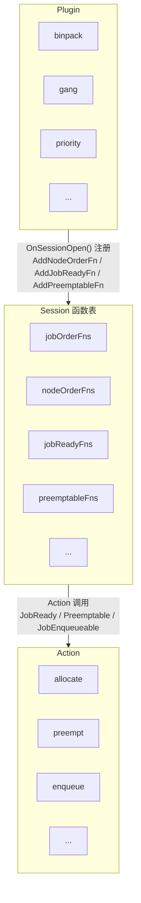
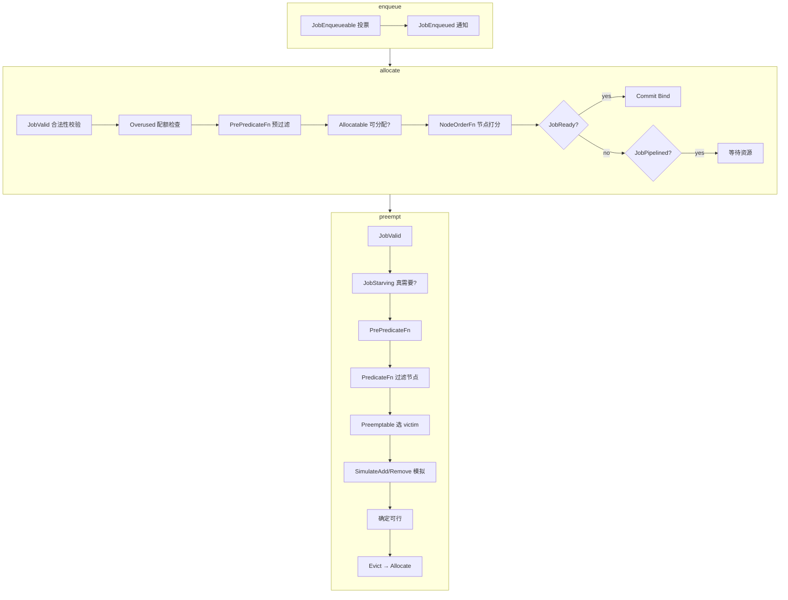

# Volcano 调度器：Plugin 注册 × Action 调用 全览

## 目录

1. [机制简述](#1-机制简述)
2. [插件注册总表](#2-插件注册总表)
3. [调度函数速查](#3-调度函数速查)
4. [Action 调用总表](#4-action-调用总表)
5. [连接矩阵](#5-连接矩阵)
6. [配置开关速查](#6-配置开关速查)

---

## 1. 机制简述

### 交互模型

**三步走**：

1. **Plugin.OnSessionOpen()** → 调用 `ssn.AddXxxFn()` 把回调函数注册到 Session
2. **Action.Execute()** → 调用 `ssn.XxxFn()` 触发所有已注册的插件回调
3. **开关控制** → YAML 中的 `enableXxx: true/false` 决定某个插件的某个回调是否生效

### 排序 vs 过滤 vs 打分

插件注册的函数按语义分为三类：

| 类型 | 接口签名特征 | 作用 | 例子 |
|------|------------|------|------|
| **排序** | `CompareFn`: `func(l,r) int` | 决定队列中谁优先 | `JobOrderFn`, `QueueOrderFn` |
| **过滤/判定** | `ValidateFn`: `func(obj) bool` | 决定是否通过 | `JobReadyFn`, `JobValidFn`, `PredicateFn` |
| **打分** | `NodeOrderFn`: `func(task,node) float64` | 节点优先级 | `NodeOrderFn`, `BatchNodeOrderFn` |
| **投票** | `VoteFn`: `func(obj) int` (1/0/-1) | 多插件投票 | `JobPipelinedFn`, `JobEnqueueableFn` |
| **选择** | `EvictableFn`: `func(preemptor, victims) victims` | 选择 victim | `PreemptableFn`, `ReclaimableFn` |

---

## 2. 插件注册总表

每个插件在 `OnSessionOpen` 中注册的函数一览。

| 插件 | 用途 | 注册的函数 | 类型 |
|------|------|-----------|------|
| **binpack** | Best-Fit 紧凑装箱：优先选利用率高的节点 | `NodeOrderFn` | 打分 |
| **capacity** | 资源容量管控：检查 Queue 配额、可用性，设置资源使用上限 | `ReclaimableFn`, `UnifiedEvictableFn`, `PreemptiveFn`, `AllocatableFn`, `JobEnqueueableFn`, `PrePredicateFn`, `SimulateAddTaskFn`, `SimulateRemoveTaskFn`, `SimulateAllocatableFn`, `EventHandler`, `QueueOrderFn`, `VictimQueueOrderFn` | 判定+排序+模拟 |
| **cdp** | CDP 环境亲和：跨集群调度时保持 Pod 在匹配的节点 | `PreemptableFn`, `ReclaimableFn` | 选择 victim |
| **conformance** | 合规性检查：确保调度决策符合特定策略 | `PreemptableFn`, `ReclaimableFn`, `UnifiedEvictableFn` | 选择 victim |
| **deviceshare** | GPU 共享：支持多 Pod 共享同一张 GPU 卡 | `PredicateFn`, `NodeOrderFn`, `BatchNodeOrderFn` | 过滤+打分 |
| **drf** | 主导资源公平（DRF）：按任务的主导资源需求公平分配 | `PreemptableFn`, `QueueOrderFn`, `ReclaimableFn`, `JobOrderFn`, `EventHandler` | 排序+选择 |
| **extender** | 外部扩展：将过滤和打分委托给外部 HTTP 服务 | `PredicateFn`, `BatchNodeOrderFn`, `PreemptableFn`, `ReclaimableFn`, `JobEnqueueableFn`, `OverusedFn`, `JobReadyFn`, `EventHandler` | 过滤+打分+选择+判定 |
| **gang** | Gang 成组调度：All-or-Nothing，Job 的所有 Task 凑够 MinAvailable 才执行 Bind | `JobValidFn`, `ReclaimableFn`, `PreemptableFn`, `UnifiedEvictableFn`, `JobOrderFn`, `SubJobOrderFn`, `JobReadyFn`, `SubJobReadyFn`, `JobPipelinedFn`, `SubJobPipelinedFn`, `JobStarvingFns` | **全类型**（排序+判定+选择） |
| **model-locality（非官方插件，个人测试demo）** | 模型本地性：优先调度到已有相同模型的节点，减少拉取开销 | `PredicateFn`, `NodeOrderFn`, `EventHandler` | 过滤+打分 |
| **network-topology-aware** | 网络拓扑感知：按 HyperNode 层级分组，优化跨机架/跨数据中心调度 | `HyperNodeOrderFn`, `BatchNodeOrderFn`, `HyperNodeGradientForJobFn`, `HyperNodeGradientForSubJobFn`, `EventHandler` | 打分+分组 |
| **nodegroup** | 节点分组：限制 Pod 只能调度到指定 label 的节点组 | `NodeOrderFn`, `PredicateFn` | 过滤+打分 |
| **nodeorder** | K8s 原生策略适配：将 8 种 K8s ScorePlugin 包装为 Volcano NodeOrder 插件 | `NodeOrderFn`, `BatchNodeOrderFn` | 打分 |
| **numaaware** | NUMA 感知：将 Pod 调度到 NUMA 拓扑最优的节点 | `EventHandler`, `PredicateFn`, `BatchNodeOrderFn` | 过滤+打分 |
| **overcommit** | 资源超卖：允许 Job 入队时超出 Queue 配额，支持资源超分 | `JobEnqueueableFn`, `JobEnqueuedFn` | 投票+通知 |
| **pdb** | PodDisruptionBudget：抢占时保护有 PDB 的 Pod | `VictimTasksFns`, `ReclaimableFn`, `PreemptableFn` | 选择 victim |
| **predicates** | 基础预选：节点资源是否满足 Task 需求、端口冲突、卷绑定等 K8s 原生过滤 | `EventHandler`, `PrePredicateFn`, `PredicateFn`, `BatchNodeOrderFn`, `SimulateAddTaskFn`, `SimulateRemoveTaskFn`, `SimulatePredicateFn` | 过滤+打分+模拟 |
| **priority** | 优先级排序：按 Job/Pod 优先级排序 Task 和 Job | `TaskOrderFn`, `JobOrderFn`, `SubJobOrderFn`, `PreemptableFn`, `UnifiedEvictableFn`, `JobStarvingFns` | 排序+选择 |
| **proportion** | 比例公平：按 Queue 权重动态分配集群资源，保证多租户公平 | `QueueOrderFn`, `ReclaimableFn`, `OverusedFn`, `AllocatableFn`, `SimulateAllocatableFn`, `PreemptiveFn`, `PrePredicateFn`, `JobEnqueueableFn`, `SimulateAddTaskFn`, `SimulateRemoveTaskFn`, `EventHandler` | 排序+判定+模拟 |
| **rescheduling** | 重调度：选择需要被驱逐后重新调度的 Task | `VictimTasksFns` | 选择 victim |
| **resource-strategy-fit** | 资源策略匹配：根据 Pod 的资源策略选择匹配的节点 | `PredicateFn`, `NodeOrderFn` | 过滤+打分 |
| **resourcequota** | 资源配额：基于 Namespace ResourceQuota 限制 Job 入队 | `JobEnqueueableFn` | 投票 |
| **sla** | SLA 保障：按等待时间排序，超时未调度的 Job 优先处理 | `JobOrderFn`, `JobEnqueueableFn`, `JobPipelinedFn` | 排序+判定 |
| **task-topology** | Task 拓扑：关联 Task 之间的亲和/反亲和排序 | `TaskOrderFn`, `NodeOrderFn`, `EventHandler` | 排序+打分 |
| **tdm** | 分时调度：按时间段控制不同 Queue 的资源分配策略 | `PredicateFn`, `NodeOrderFn`, `PreemptableFn`, `VictimTasksFns`, `JobOrderFn`, `JobPipelinedFn`, `JobStarvingFns` | 过滤+打分+选择+判定 |
| **usage** | 真实用量：基于节点实际资源用量而不是 request 值来过滤和打分 | `PredicateFn`, `NodeOrderFn` | 过滤+打分 |

---

## 3. 调度函数速查

插件可注册的全部回调函数及其接口签名、用途一览。签名来源：`pkg/scheduler/framework/interface.go` 和 `session_plugins.go`。

| 函数 | 接口签名 | 作用 |
|------|---------|------|
| `JobOrderFn` | `func(l,r *JobInfo) int` | Job 排序：返回值 <0 则 l 优先，>0 则 r 优先 |
| `SubJobOrderFn` | `func(l,r *SubJobInfo) int` | SubJob 排序，同 JobOrderFn |
| `TaskOrderFn` | `func(l,r *TaskInfo) int` | Task 排序：决定同一个 Job 内哪些 Task 先分配节点 |
| `QueueOrderFn` | `func(l,r *QueueInfo) int` | Queue 排序：决定调度器先处理哪个 Queue 的 Job |
| `VictimQueueOrderFn` | `func(l,r,preemptor *QueueInfo) int` | 抢占场景下的 Queue 排序：优先从哪个 Queue 抢资源 |
| `ClusterOrderFn` | `func(l,r *Cluster) int` | 多集群场景下的 Cluster 排序 |
| `JobReadyFn` | `func(obj *JobInfo) bool` | 判断 Job 是否就绪可 Bind（ReadyTaskNum ≥ MinAvailable） |
| `SubJobReadyFn` | `func(obj *SubJobInfo) bool` | SubJob 级别就绪判定 |
| `JobPipelinedFn` | `func(obj *JobInfo) int` | 投票：Job 是否可进入 Pipelined 状态（返回 Permit/Reject） |
| `SubJobPipelinedFn` | `func(obj *SubJobInfo) int` | SubJob 级别 Pipelined 投票 |
| `JobValidFn` | `func(obj *JobInfo) *ValidateResult` | Job 合法性校验：Pod 数量是否满足 TaskMinAvailable 等 |
| `JobStarvingFn` | `func(obj *JobInfo) bool` | 判断 Job 是否 Starving：Ready+Pipelined < MinAvailable，需抢占 |
| `JobEnqueueableFn` | `func(obj *JobInfo) int` | 投票：Job 是否可以入队（enqueue action 调用） |
| `JobEnqueuedFn` | `func(obj *JobInfo)` | Job 入队后的回调通知（无返回值，纯副作用） |
| `PredicateFn` | `func(task *TaskInfo, node *NodeInfo) error` | 节点过滤：检查 Task 能否放到该节点，返回 error 表示不可行 |
| `PrePredicateFn` | `func(task *TaskInfo) error` | 预选前处理：在遍历节点之前做预处理和早期失败检测 |
| `NodeOrderFn` | `func(task *TaskInfo, node *NodeInfo) (float64,error)` | 节点打分：为单个 node 评分，分数越高越优先 |
| `BatchNodeOrderFn` | `func(task *TaskInfo, nodes []*NodeInfo) (map[string]float64,error)` | 批量节点打分：需要全局视角（如 Pod 亲和性）时使用 |
| `NodeMapFn` | `func(task *TaskInfo, node *NodeInfo) (float64,error)` | 节点 Map 阶段打分，结果由 Reduce 合并 |
| `NodeReduceFn` | `func(task *TaskInfo, scores NodeScoreList) error` | 节点 Reduce 阶段，合并多个插件的 Map 结果 |
| `BestNodeFn` | `func(task *TaskInfo, scores map[float64][]*NodeInfo) *NodeInfo` | 从一组同分节点中选择最优节点 |
| `PreemptableFn` | `func(preemptor *TaskInfo, victims []*TaskInfo) ([]*TaskInfo,int)` | 选择可安全抢占的 victim：返回允许抢占的 Task 列表 |
| `ReclaimableFn` | `func(reclaimer *TaskInfo, victims []*TaskInfo) ([]*TaskInfo,int)` | 选择可安全回收的 victim：返回允许回收的 Task 列表 |
| `UnifiedEvictableFn` | `func(ctx *EvictionContext, candidates []*TaskInfo) ([]*TaskInfo,int)` | 统一驱逐接口（bundle 模型）：Gang 级抢占/回收使用 |
| `VictimTasksFn` | `func(tasks []*TaskInfo) []*TaskInfo` | 选择应被驱逐的 victim Task（shuffle action 调用） |
| `OverusedFn` | `func(queue *QueueInfo) bool` | 判断 Queue 是否超用：已分配资源超过配额 |
| `AllocatableFn` | `func(queue *QueueInfo, task *TaskInfo) bool` | 判断 Queue 是否有余量接收此 Task 的分配 |
| `PreemptiveFn` | `func(queue *QueueInfo, candidates []*TaskInfo) bool` | 判断是否允许对此 Queue 的候选 Task 执行抢占 |
| `TargetJobFn` | `func(jobs []*JobInfo) *JobInfo` | 从候选 Job 中选择一个作为抢占/回收目标 |
| `ReservedNodesFn` | `func()` | 预留节点：标记某些节点为指定 Job 保留 |
| `HyperNodeOrderFn` | `func(subJob *SubJobInfo, nodes map[string][]*NodeInfo) (map[string]float64,error)` | HyperNode 级别打分（网络拓扑感知调度） |
| `HyperNodeGradientForJobFn` | `func(job *JobInfo, hyperNode *HyperNodeInfo, purpose SearchPurpose) [][]*HyperNodeInfo` | 为 Job 生成 HyperNode 梯度分组 |
| `HyperNodeGradientForSubJobFn` | `func(subJob *SubJobInfo, hyperNode *HyperNodeInfo, purpose SearchPurpose) [][]*HyperNodeInfo` | 为 SubJob 生成 HyperNode 梯度分组 |
| `SimulateAddTaskFn` | `func(ctx CycleState, task, added *TaskInfo, node *NodeInfo) error` | 模拟：把 added Task 加到 node 后，task 能否调度 |
| `SimulateRemoveTaskFn` | `func(ctx CycleState, task, removed *TaskInfo, node *NodeInfo) error` | 模拟：从 node 移除 removed Task 后，task 能否调度 |
| `SimulateAllocatableFn` | `func(ctx CycleState, queue *QueueInfo, task *TaskInfo) bool` | 模拟：在此状态下 Queue 是否还能接收分配 |
| `SimulatePredicateFn` | `func(ctx CycleState, task *TaskInfo, node *NodeInfo) error` | 模拟：在此状态下 Predicate 是否通过 |

## 4. Action 调用总表

每个 Action 的职责及调用的 Session 函数一览。函数的用途详见[第 3 节](#3-调度函数速查)。

| Action | 作用 | 调用的函数 |
|--------|------|-----------|
| **enqueue** | 过滤不可调度的 Job，将符合条件的放入调度队列 | `JobEnqueueable`, `JobEnqueued` |
| **allocate** | 核心调度：为 Job 的 Pending Task 分配节点资源 | `JobValid`, `Overused`, `HyperNodeGradientForJobFn`, `HyperNodeGradientForSubJobFn`, `PrePredicateFn`, `Allocatable`, `SubJobOrderFn`, `JobReady`, `JobPipelined`, `SubJobReady`, `SubJobPipelined`, `BestNodeFn`, `SchGateManager`, `MarkJobDirty` |
| **backfill** | 为非 Gang 的零散 Task 补充调度 | `JobValid`, `PrePredicateFn`, `BestNodeFn` |
| **preempt** | 为 Starving Job 抢占低优先级 Task 的资源 | `JobValid`, `JobStarving`, `JobPipelined`, `PrePredicateFn`, `PredicateFn`, `Preemptable`, `Allocatable`, `SimulateAddTaskFn`, `SimulateRemoveTaskFn`, `SimulateAllocatableFn`, `SimulatePredicateFn`, `BuildVictimsPriorityQueue` |
| **reclaim** | 回收超用 Queue 的资源，重新分配给等待中 Job | `JobValid`, `JobStarving`, `JobPipelined`, `Overused`, `Preemptive`, `PrePredicateFn`, `Reclaimable`, `BuildVictimsPriorityQueue` |
| **gangpreempt** | 按 Gang 语义整体抢占（bundle 模型） | `JobValid`, `JobOrderFn`, `JobStarving`, `JobPipelined`, `UnifiedEvictable` |
| **gangreclaim** | 按 Gang 语义整体回收（bundle 模型） | `JobValid`, `JobStarving`, `JobPipelined`, `Overused`, `Preemptive`, `QueueOrderFn`, `VictimQueueOrderFn`, `UnifiedEvictable` |
| **shuffle** | 驱逐并重新调度 Task 以减少碎片 | `VictimTasks`, `Evict` |

---

## 5. 连接矩阵

Action（列）× 扩展点（行），标注哪些 Action 调用了哪些扩展点。

| 扩展点 | enqueue | allocate | backfill | preempt | reclaim | gang-preempt | gang-reclaim | shuffle |
|--------|:-------:|:--------:|:--------:|:-------:|:-------:|:------------:|:------------:|:-------:|
| `JobEnqueueable` | ✓ | | | | | | | |
| `JobEnqueued` | ✓ | | | | | | | |
| `JobValid` | | ✓ | ✓ | ✓ | ✓ | ✓ | ✓ | |
| `JobReady` | | ✓ | | | | | | |
| `JobPipelined` | | ✓ | | ✓ | ✓ | ✓ | ✓ | |
| `SubJobReady` | | ✓ | | | | | | |
| `SubJobPipelined` | | ✓ | | | | | | |
| `SubJobOrderFn` | | ✓ | | | | | | |
| `JobStarving` | | | | ✓ | ✓ | ✓ | ✓ | |
| `JobOrderFn` | | | | | | ✓ | | |
| `QueueOrderFn` | | | | | | | ✓ | |
| `VictimQueueOrderFn` | | | | | | | ✓ | |
| `TaskOrderFn` | | | | | | | | |
| `Overused` | | ✓ | | | ✓ | | ✓ | |
| `Preemptive` | | | | | ✓ | | ✓ | |
| `Allocatable` | | ✓ | | ✓ | | | | |
| `PrePredicateFn` | | ✓ | ✓ | ✓ | ✓ | | | |
| `PredicateFn` | | | | ✓ | | | | |
| `NodeOrderFn` | | * | | | | | | |
| `BatchNodeOrderFn` | | * | | | | | | |
| `BestNodeFn` | | ✓ | ✓ | | | | | |
| `Preemptable` | | | | ✓ | | | | |
| `Reclaimable` | | | | | ✓ | | | |
| `UnifiedEvictable` | | | | | | ✓ | ✓ | |
| `VictimTasks` | | | | | | | | ✓ |
| `BuildVictimsPriorityQueue` | | | | ✓ | ✓ | | | |
| `SimulateAddTaskFn` | | | | ✓ | | | | |
| `SimulateRemoveTaskFn` | | | | ✓ | | | | |
| `SimulateAllocatableFn` | | | | ✓ | | | | |
| `SimulatePredicateFn` | | | | ✓ | | | | |
| `HyperNodeGradientForXxx` | | ✓ | | | | | | |
| `HyperNodeOrderFn` | | * | | | | | | |
| `Evict` | | | | | | | | ✓ |

> \* `NodeOrderFn` / `BatchNodeOrderFn` / `HyperNodeOrderFn` 是 allocate 内部通过 `util.PrioritizeNodes` 间接调用的。

### 5.1 核心 Action 流程示意

---

## 6. 配置开关速查

在 YAML 配置中通过 `enableXxx: true` 启用某个插件在某个扩展点上的回调。`nil` 等同于 `false`。

| YAML 字段 | 对应扩展点 | 主要使用者 |
|-----------|-----------|-----------|
| `enableJobOrder` | `JobOrderFn` | gang, priority, drf, sla, tdm |
| `enableJobReady` | `JobReadyFn` | **gang**, extender |
| `enableJobPipelined` | `JobPipelinedFn` | **gang**, sla, tdm |
| `enableTaskOrder` | `TaskOrderFn` | priority, task-topology |
| `enablePreemptable` | `PreemptableFn` | **gang**, priority, conformance, cdp, pdb, tdm |
| `enableReclaimable` | `ReclaimableFn` | **gang**, capacity, conformance, drf, pdb, proportion |
| `enablePreemptive` | `PreemptiveFn` | capacity, proportion |
| `enableQueueOrder` | `QueueOrderFn` | capacity, drf, proportion |
| `enablePredicate` | `PredicateFn` | **predicates**, deviceshare, numaaware, usage 等 |
| `enableBestNode` | `BestNodeFn` | (预留) |
| `enableNodeOrder` | `NodeOrderFn` | **binpack**, **nodeorder**, deviceshare, model-locality 等 |
| `enableTargetJob` | `TargetJobFn` | (预留) |
| `enableJobEnqueued` | `JobEnqueueableFn` / `JobEnqueuedFn` | overcommit, proportion, resourcequota, sla |
| `enabledVictim` | `VictimTasksFns` | pdb, rescheduling, tdm |
| `enableJobStarving` | `JobStarvingFns` | **gang**, priority, tdm |
| `enabledOverused` | `OverusedFn` | proportion, extender |
| `enabledAllocatable` | `AllocatableFn` | capacity, proportion |
| `enabledHyperNodeOrder` | `HyperNodeOrderFn` | network-topology-aware |
| `enabledSubJobReady` | `SubJobReadyFn` | gang |
| `enabledSubJobPipelined` | `SubJobPipelinedFn` | gang |
| `enabledSubJobOrder` | `SubJobOrderFn` | gang |
| `enabledHyperNodeGradient` | `HyperNodeGradientFn` | network-topology-aware |

---

*文档生成日期：2026-06-20*
