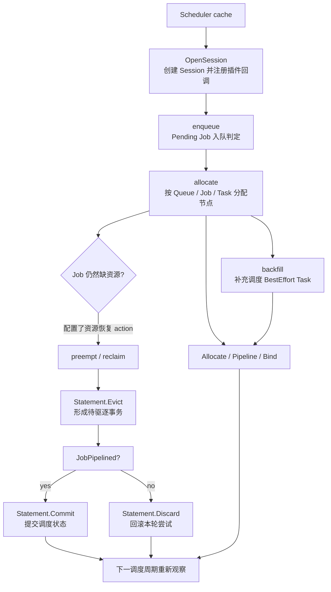
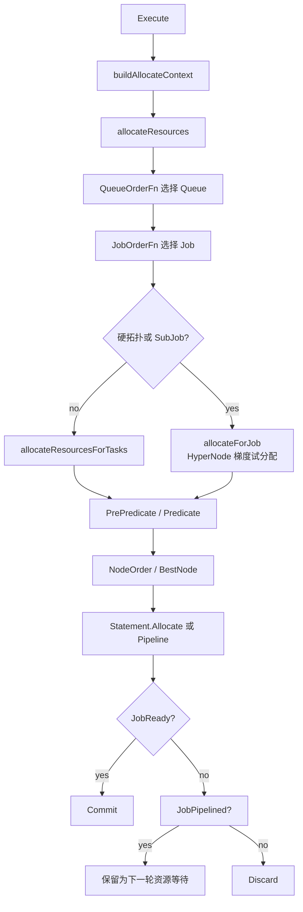

# Volcano Scheduler 核心 Action 源码解读计划

## 1. 文档目标

本文档是 Volcano scheduler action 源码文章的 plan，不是最终成稿。目标是回答三个问题：

1. 一个调度周期如何串起多个 action；
2. 哪些 action 可以称为核心 action；
3. 文章应该按一篇总览组织，还是按 action 拆分。

源码基准暂定为最近的稳定 tag `v1.14.2`。当前工作树是 `v1.15.0-alpha.0` 之后的开发分支，并包含未提交的设备共享改动；这些改动不属于本计划的证据范围。当前分支新增的 `gangpreempt` 和 `gangreclaim` 只作为后续专题记录，不作为 `v1.14.2` 的稳定版本事实。

## 2. Action 的边界

这里的 action 专指 `pkg/scheduler/actions` 下、由 scheduler 调度周期调用的 `framework.Action`。不把以下内容混入 action 本体：

- `pkg/scheduler/plugins` 下的插件。插件通过 Session 回调提供排序、过滤、打分和 victim 选择能力；它们是 action 的扩展点，不是 action；
- `pkg/scheduler/framework` 下的 `Session`、`Statement` 和 predicate 工具。它们是 action 的执行环境和事务工具；
- `pkg/agentscheduler/actions` 下的 agent scheduler action。它与普通 scheduler 有不同的调度入口和工作对象；
- Job controller 的 `SyncJob`、`RestartJob` 等 controller action。它们处理 Job 生命周期，不负责节点调度。

### 2.1 核心 action 的判定标准

一个 action 纳入“核心”范围，需要满足至少一项，并且能解释调度周期中的状态变化：

1. 出现在默认 action 链中，直接参与普通 Pod 的入队、分配或补充调度；
2. 在资源不足时改变资源占用关系，推动等待中的 Job 获得资源；
3. 通过 `Session` 和 `Statement` 产生可观察的调度结果，例如 `Allocate`、`Pipeline`、`Evict` 或 Job 状态更新。

按这个标准，建议分成三层：

| 层次 | Action | 本计划中的处理 | 结论 |
| --- | --- | --- | --- |
| 默认主链 | `enqueue`、`allocate`、`backfill` | 纳入总览和主文 | 最核心 |
| 资源恢复链 | `preempt`、`reclaim` | 纳入总览，作为第二条主流程 | 核心但非默认 |
| 辅助/扩展 | `shuffle`、`gangpreempt`、`gangreclaim` | 后续专题或附录 | 不放入第一篇正文 |

`v1.14.2` 的默认配置是 `enqueue, allocate, backfill`。`preempt` 与 `reclaim` 虽然不在默认配置中，但它们处理的是多租户调度不可回避的资源竞争问题，且已有多处官方配置和插件文档将它们加入 action 链，因此应纳入“核心但可选”范围。

`shuffle` 依赖 `VictimTasks` 选择需要重新调度的运行中 Task，职责是减少碎片或执行重调度策略，不参与默认调度主链。当前分支的 `gangpreempt` 和 `gangreclaim` 以 HyperNode 和 Job bundle 为核心，已经形成独立的 Gang 驱逐模型；它们适合单独写成设计与实现专题。

## 3. 一个调度周期的总览

稳定版本文章的总览流程如下：

源码入口和证据索引：

| 环节 | 源码位置 | 需要说明的事实 |
| --- | --- | --- |
| action 链执行 | `pkg/scheduler/scheduler.go` 的 `Scheduler.runOnce` | 同一个 Session 中按配置顺序调用 `action.Execute(ssn)` |
| 默认 action 链 | `pkg/scheduler/util.go` 的 `DefaultSchedulerConf` | 默认顺序是 `enqueue → allocate → backfill` |
| action 注册 | `pkg/scheduler/actions/factory.go` | action 先注册到 framework，配置再通过名字查找实例 |
| Session 生命周期 | `pkg/scheduler/framework/framework.go` | `OpenSession` 创建本轮调度视图，`CloseSession` 释放本轮资源 |
| 事务提交 | `pkg/scheduler/framework/statement.go` | `Allocate`、`Pipeline`、`Evict` 先记录操作，`Commit` 或 `Discard` 决定结果 |

文字版流程固定为 5 步：

1. scheduler 打开 Session，把插件回调装配到本轮调度上下文；
2. `enqueue` 依据 Queue 顺序和 `JobEnqueueable` 投票，把可调度 Job 标记为 Inqueue；
3. `allocate` 组织 Queue、Job、SubJob、Task 工作表，过滤节点并打分，产生 Allocate 或 Pipeline 操作；
4. `backfill` 处理剩余的 BestEffort Task，走较短的 Predicate → NodeOrder → Allocate 路径；
5. 如果等待中的 Job 仍然 Starving，配置了 `preempt` 或 `reclaim` 时再尝试寻找 victim，并通过 Statement 提交或回滚。

## 4. 五个核心 action 的实现主线

### 4.1 `enqueue`：把 Pending Job 放入调度入口

入口：`pkg/scheduler/actions/enqueue/enqueue.go:44` 的 `Action.Execute`。

计划重点：

- 遍历 Session 中的 Job，按 Queue 建立 Queue 优先队列和 Job 优先队列；
- 对 `Pending` Job 调用 `ssn.JobEnqueueable(job)`；
- 通过 `ssn.JobEnqueued(job)` 和 `PodGroup.Status.Phase = Inqueue` 写入入队结果；
- 说明 `enqueue` 与 `allocate` 的边界：前者回答“是否允许进入调度队列”，后者回答“Task 放到哪个节点”。

需要核对的限制：没有配置 `enqueue` 时，`allocate.buildAllocateContext` 会把 Pending PodGroup 转为 Inqueue，以免普通调度被入队 action 缺失阻塞。

### 4.2 `allocate`：普通调度的核心执行器

入口：`pkg/scheduler/actions/allocate/allocate.go:169` 的 `Action.Execute`。

计划主线：

计划重点：

- `buildAllocateContext` 负责把 Job 组织成 Queue → Job → SubJob → Task 的工作表；
- 普通路径逐 Task 过滤节点、调用 `PrioritizeNodes`，再由 `BestNodeFn` 选节点；
- 硬拓扑或 SubJob 路径需要对多个 HyperNode 做试分配，选出可行方案后恢复 Statement；
- `Idle` 资源足够时可以 Allocate，只有 `FutureIdle` 足够时进入 Pipeline；
- **是否 Commit 由 Job/Gang 就绪条件决定，不是由单个 Task 找到节点决定**。

已有 `pkg/scheduler/actions/allocate/ANALYSIS.md` 已经覆盖该 action 的深度分析，本篇只保留它在全局 action 链中的职责、输入输出和与其他 action 的接口。

### 4.3 `backfill`：补充调度 BestEffort Task

入口：`pkg/scheduler/actions/backfill/backfill.go:58` 的 `Action.Execute`。

计划重点：

- `pickUpPendingTasks` 只收集非 Pending Job 中的 BestEffort Task，并处理 Pipelined Task 的回退；
- 每个 Task 经过 `PrePredicateFn` 和 Predicate 过滤节点；
- 多个候选节点时调用批量 NodeOrder 和 `BestNodeFn`；
- 直接调用 `ssn.Allocate(task, node)`，不承担完整 Gang Job 的工作表和全局就绪提交逻辑；
- 说明它为什么放在 `allocate` 后：在不破坏主调度结果的前提下利用碎片资源。

### 4.4 `preempt`：同一 Queue 内的 Task 级抢占

入口：`pkg/scheduler/actions/preempt/preempt.go:101` 的 `Action.Execute`。

计划主线：

1. 找出 `JobStarving(job)` 的 Job，并按 Queue、Job、Task 优先级建立抢占者队列；
2. 为抢占者寻找满足 Predicate 的候选节点；
3. 通过 `Preemptable` 过滤和排序 victim；
4. 使用 `SimulateAddTask`、`SimulateRemoveTask` 等模拟接口验证驱逐后是否真的可调度；
5. 将 victim 驱逐写入 Statement；只有抢占者进入 Pipelined 状态时才 Commit，否则 Discard。

文章中需要明确：`preempt` 是 Queue 内 Job/Task 之间的资源抢占，`reclaim` 是 Queue 资源回收，两者都可能驱逐 Task，但触发条件和 victim 的跨 Queue 约束不同。

### 4.5 `reclaim`：跨 Queue 回收可回收资源

入口：`pkg/scheduler/actions/reclaim/reclaim.go:56` 的 `Action.Execute`。

计划主线：

1. 找出 Starving Job，并跳过已超用的 Queue；
2. 对待调度 Task 检查 `Preemptive(queue, task)`、Pod 的 `PreemptNever` 策略和 `PrePredicateFn`；
3. 在可回收 Queue 的运行 Task 中构造 reclaimee 候选；
4. 由 `Reclaimable` 和 victim priority queue 选出足以满足资源需求的 victim；
5. 通过 `Statement.Evict` 记录回收操作，依据 `JobPipelined` 决定 Commit 或 Discard。

文章需要用一张对比表固定两个边界：

| 对比项 | `preempt` | `reclaim` |
| --- | --- | --- |
| 主要关系 | 同一 Queue 内 Job 之间 | 通常跨 Queue 回收资源 |
| 需求判定 | `JobStarving` | `JobStarving` + Queue 未超用 |
| victim 扩展点 | `Preemptable` | `Reclaimable` |
| 可调度性验证 | Predicate + 多种 Simulation | PrePredicate + 节点 Predicate + victim 校验 |
| 结果 | 抢占并为高优先级 Job 腾挪资源 | 回收可回收 Queue 的资源 |

## 5. 不纳入第一篇正文的 action

### `shuffle`

它的流程短：收集所有 Running Task → 调用 `VictimTasks` → `ssn.Evict(victim, "shuffle")`。该 action 的难点不在 action 本身，而在 rescheduling、PDB 等插件如何决定 victim，建议在重调度专题中说明。

### `gangpreempt` / `gangreclaim`

当前分支的实现已经从 Task 级 victim 选择扩展为 HyperNode 范围内的 Job bundle 选择，并使用 `UnifiedEvictable`、nomination plan 和 Statement 恢复操作。它们与旧 `preempt` / `reclaim` 的共性是“Starving → 选择 victim → Evict → Pipelined/Commit”，但数据结构和可行性搜索明显不同。

这两个 action 不进入 `v1.14.2` 稳定版本主文。后续专题的版本基准应改为包含该实现的明确 commit 或新稳定 tag，并在正文中说明当前源码实际注册名是小写的 `gangpreempt`、`gangreclaim`。

## 6. 文章组织方案

### 结论

不建议“每个 action 单独一篇”，也不建议把 8 个 action 的源码细节压成一篇。建议采用两层结构：

1. 一篇总览文章，解释 action 链和五个核心 action 的职责边界；
2. 对复杂 action 做专题文章，复用总览中的概念和流程，不重复解释 Session、Queue、Job、Task。

### 第一篇：核心 Action 总览

建议标题：**Volcano Scheduler 核心 Action：从入队到分配、抢占与回收**。

正文范围：`enqueue`、`allocate`、`backfill`、`preempt`、`reclaim`。

建议结构：

1. 背景：Session、插件回调和 Statement 的职责边界；
2. 调度周期总览图；
3. 默认主链：`enqueue → allocate → backfill`；
4. 资源恢复链：`preempt` 与 `reclaim`；
5. 五个 action 的输入、关键判定、状态变化和输出；
6. `preempt` 与 `reclaim` 对比；
7. 版本边界、配置顺序和排查入口。

这篇文章回答“整个 action 系统如何工作”，不展开 `allocate` 的 HyperNode 搜索细节，也不展开每个插件的实现。

### 后续专题

| 专题 | 建议内容 | 现有材料 |
| --- | --- | --- |
| Allocate 深度分析 | Worksheet、Predicate、NodeOrder、Idle/FutureIdle、Commit | `pkg/scheduler/actions/allocate/ANALYSIS.md` 已有初稿 |
| Preempt 与 Reclaim | 两类资源恢复的完整 victim 选择和 Simulation | 需要新建专题 |
| Gang Eviction | `gangpreempt` / `gangreclaim`、bundle、HyperNode、nomination | `docs/design/gang-aware-eviction-design.md` 可作为设计背景 |
| Shuffle 与重调度 | `VictimTasks`、PDB、rescheduling 的协作 | `docs/design/rescheduling.md`、`docs/design/pdb-plugin.md` |

## 7. 交付前的源码核对清单

- 文章正文只把 `v1.14.2` tag 中存在的文件、函数和默认配置写成稳定版本事实；
- `gangpreempt` / `gangreclaim` 使用单独版本说明，不与稳定 action 表混写；
- 每个 Go 摘录保留函数或方法签名，并明确 `// ...` 是省略代码；
- Mermaid 图标出 Session、Job/Task、Predicate、NodeOrder、Statement 和 Commit/Discard 分支；
- 解释 `Allocate`、`Pipeline`、`Evict` 时区分“写入本轮 Statement”与“提交到调度状态”；
- 明确 `enqueue` 是入队判定，`allocate` 是节点分配，插件回调只提供决策函数；
- 文章完成后按目标 tag 复核文件路径、函数签名、默认 action 顺序和配置示例；
- Markdown 与 Mermaid 围栏闭合，链接指向实际存在的文件。

## 8. 待最终确认项

当前 plan 已给出推荐答案，正式写作前只需确认两项：

1. 版本范围是否锁定为稳定 `v1.14.2`；如果要写当前分支的 Gang 驱逐，需要改用明确的开发版本基准；
2. 第一篇是否按“五个核心 action 总览”落稿，并把已有 `allocate` 深度分析保留为独立专题。

---

*本文档为 Volcano scheduler action 源码文章的 plan。*
