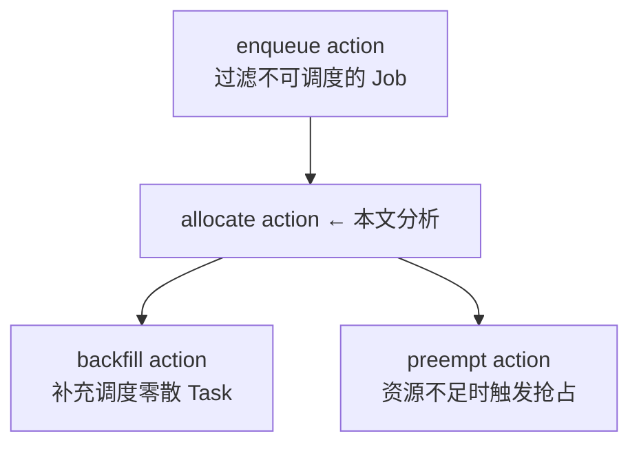
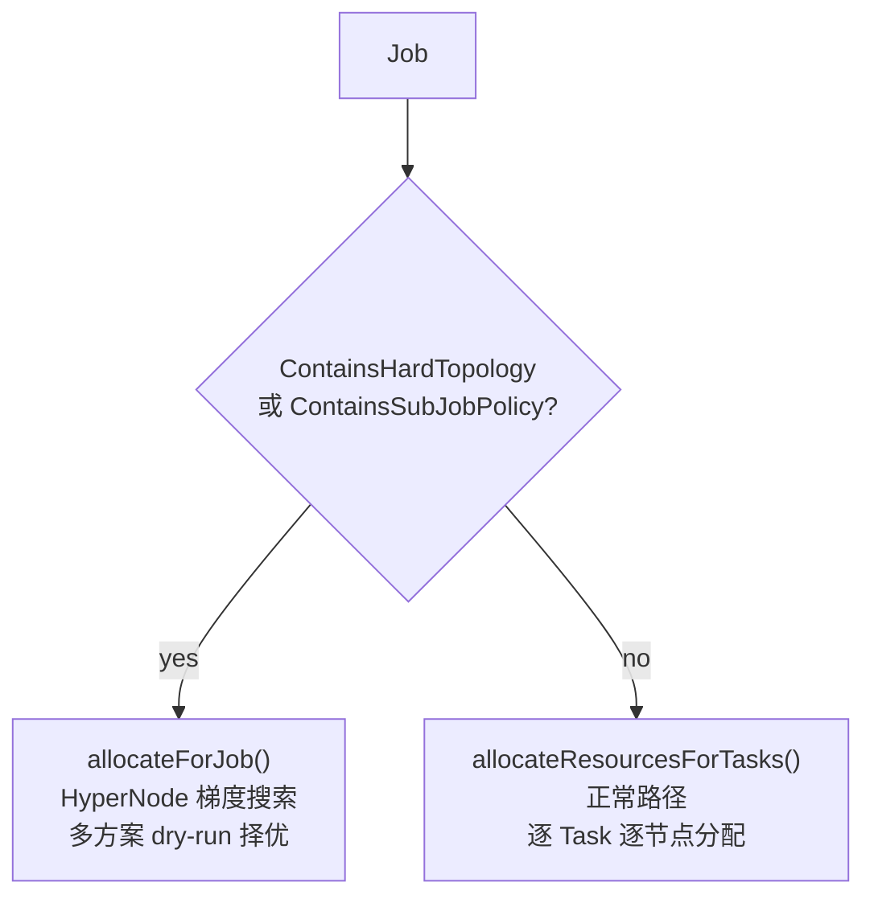
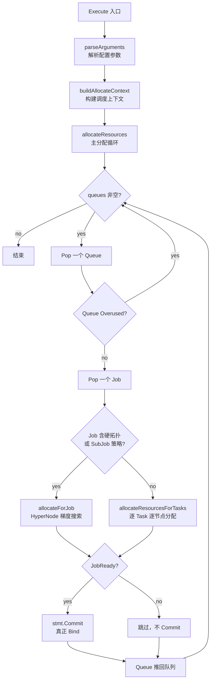
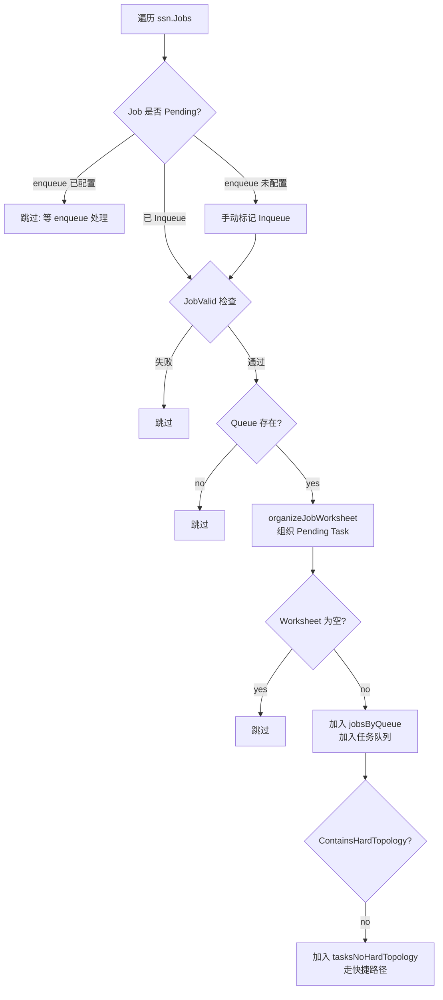
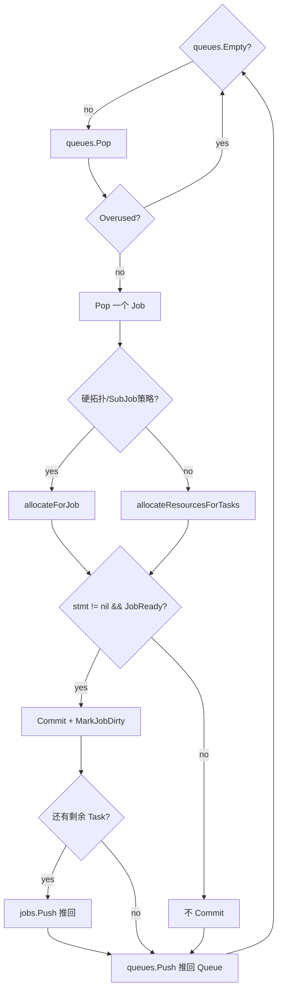
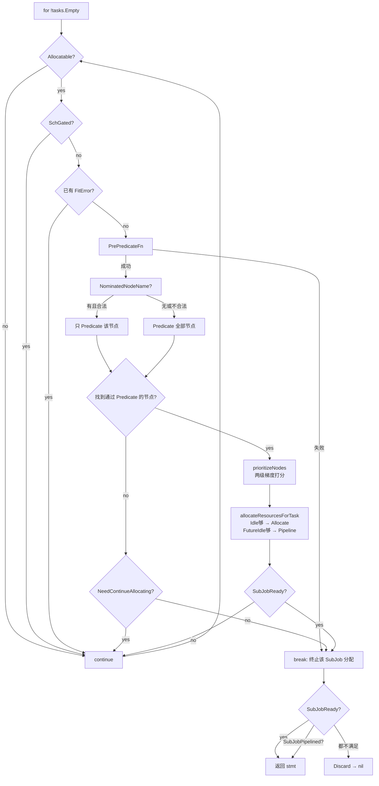
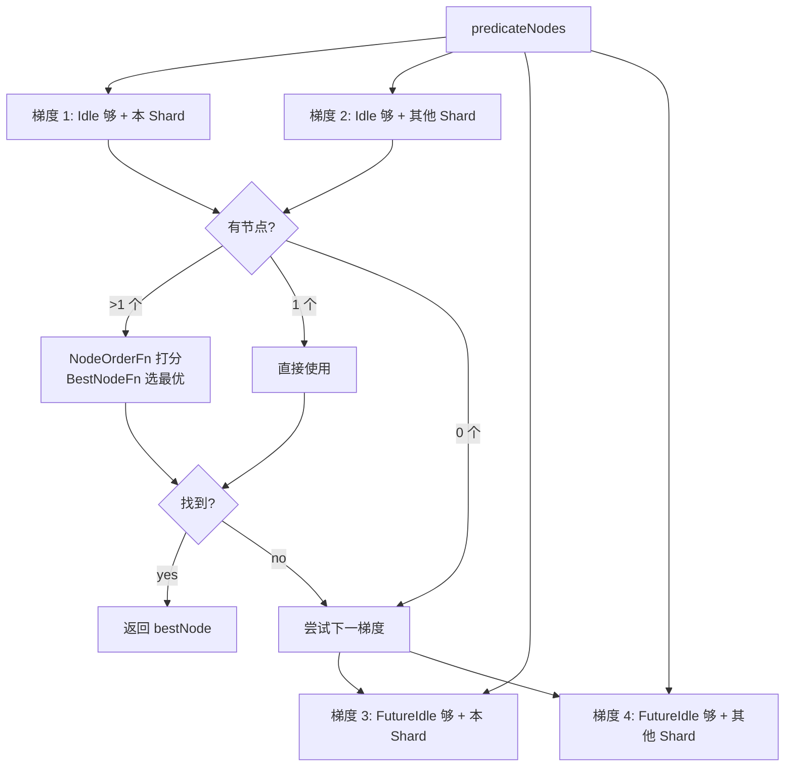
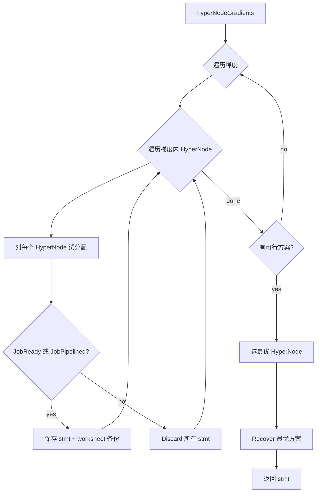
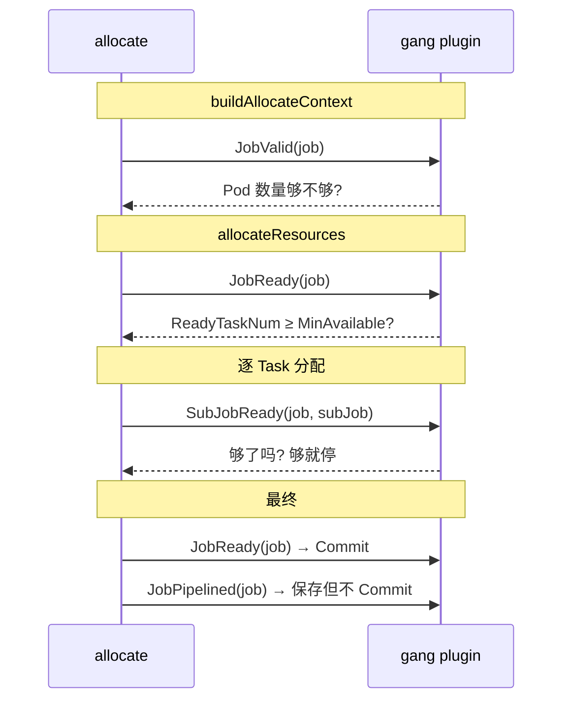

# Volcano Allocate Action 深度分析

## 目录

1. [概述](#1-概述)
2. [先理解两个概念：SubJob 和 HardTopology](#2-先理解两个概念subjob-和-hardtopology)
3. [核心数据结构](#3-核心数据结构)
4. [整体流程](#4-整体流程)
5. [详细拆解](#5-详细拆解)
6. [关键决策点](#6-关键决策点)
7. [与 Gang 的协作](#7-与-gang-的协作)
8. [设计要点](#8-设计要点)

---

## 1. 概述

### 1.1 是什么

allocate 是 Volcano 调度器**最核心的 action**，负责为 Job 的 Pending Task 分配节点资源。它实现了完整的调度流水线：Queue 排序 → Job 排序 → Task 排序 → Predicate 过滤 → NodeOrder 打分 → 分配/Bind。

### 1.2 在调度周期中的位置



### 1.3 核心文件

| 文件 | 行数 | 功能 |
|------|------|------|
| `allocate.go` | 973 | 核心实现 |
| `recorder.go` | 115 | 分配决策记录器 |

---

## 2. 先理解两个概念：SubJob 和 HardTopology

在阅读 allocate 源码之前，需要先理解这两个反复出现但文档中未曾解释的概念。

### SubJob — 一个 Job 可以被拆成多个子调度单元

**默认情况下**，一个 Job 只有一个 SubJob（称为 "default subJob"），所有 Task 都在同一个 SubJob 里。这是最常见的场景。

**当用户在 PodGroup 中配置了 `SubGroupPolicy` 时**，Volcano 会按 Pod 的 label 将 Task 拆分到不同的 SubJob 中。每个 SubJob 有自己独立的 `MinAvailable` 和 `NetworkTopology`。

[`job_info.go:1285-1302`](pkg/scheduler/api/job_info.go#L1285)：

```go
// 如果 PodGroup 配置了 SubGroupPolicy，按 label 匹配拆分
for _, policy := range ji.PodGroup.Spec.SubGroupPolicy {
    if matchValues := getSubJobMatchValues(policy, ti.Pod); len(matchValues) > 0 {
        // 创建这个 policy 对应的 SubJob
        ji.SubJobs[subJobID] = NewSubJobInfo(groupID, subJobID, ji.UID, &policy, matchValues)
    }
}
// 没有匹配任何 policy 的 Task 归入 default subJob
return ji.getOrCreateDefaultSubJob()
```

**典型场景**：一个训练 Job 跑在两个不同的数据中心，需要保证每个数据中心的 Pod 最低数量。

```
PodGroup YAML:
  subGroupPolicy:
    - name: dc-a
      labelSelector: matchLabels { datacenter: dc-a }
      subGroupSize: 2    # dc-a 数据中心至少需要 2 个 Pod 就绪
    - name: dc-b
      labelSelector: matchLabels { datacenter: dc-b }
      subGroupSize: 2    # dc-b 数据中心至少需要 2 个 Pod 就绪

结果：Job 被拆成 3 个 SubJob:
  SubJob-dc-a:  MinAvailable=2, 只有 datacenter=dc-a 的 Pod
  SubJob-dc-b:  MinAvailable=2, 只有 datacenter=dc-b 的 Pod
  DefaultSubJob: 放不匹配任何 policy 的 Pod
```

`ContainsSubJobPolicy()` 判断 Job 是否有用户显式配置的 SubJob 策略（[`job_info.go:1321`](pkg/scheduler/api/job_info.go#L1321)）：

```go
func (ji *JobInfo) ContainsSubJobPolicy() bool {
    return len(ji.PodGroup.Spec.SubGroupPolicy) > 0
}
```

### HardTopology — 硬网络拓扑约束

用户可以在 PodGroup 或 SubGroupPolicy 中声明网络拓扑要求（如"所有 Pod 必须在同一个 rack/switch 下"）。

[`types.go:261-271`](../../staging/src/volcano.sh/apis/pkg/apis/scheduling/v1beta1/types.go#L261)：

```go
type NetworkTopologyMode string
const (
    HardNetworkTopologyMode NetworkTopologyMode = "hard"  // 必须满足
    SoftNetworkTopologyMode NetworkTopologyMode = "soft"  // 优先满足
)
```

- **Hard 模式**：Pod 必须落在满足拓扑约束的 HyperNode 内，否则不调度。走 `allocateForJob()` 的多 HyperNode 梯度搜索路径。
- **Soft 模式**：优先满足，但找不到合适 HyperNode 时也能调度到其他地方。走普通路径，但会记录 `AllocatedHyperNode` 用于打分。

[`job_info.go:1339`](pkg/scheduler/api/job_info.go#L1339)：

```go
func (ji *JobInfo) ContainsHardTopology() bool {
    if hard, _ := ji.IsHardTopologyMode(); hard || ji.ContainsHardTopologyInSubJob() {
        return true
    }
    return false
}
```

**HyperNode** 是网络拓扑中的层级节点（如 rack-1、switch-a），由 `network-topology-aware` 插件管理。`ContainsHardTopology()` 为 true 时，allocate 走 `allocateForJob()` 路径——在多个 HyperNode 上试分配，选最优方案。

### 对 allocate 流程的影响



---

## 3. 核心数据结构

### 3.1 allocateContext — 调度上下文

```go
// allocate.go:41-46
type allocateContext struct {
    queues              *util.PriorityQueue    // Queue 优先级队列，排序规则=ssn.QueueOrderFn
    jobsByQueue         map[api.QueueID]*util.PriorityQueue  // 每个 Queue 的 Job 队列，排序规则=ssn.JobOrderFn
    jobWorksheet        map[api.JobID]*JobWorksheet          // 每个 Job 的调度工作表
    tasksNoHardTopology map[api.JobID]*util.PriorityQueue    // 非硬拓扑 Job 的 Task 队列，排序规则=ssn.TaskOrderFn
}
```

三层排序：
- Queue → `QueueOrderFn`（proportion 等控制）
- Job → `JobOrderFn`（gang: 未就绪优先）
- Task → `TaskOrderFn`（priority 等控制）

### 3.2 JobWorksheet — Job 调度工作表

```go
// allocate.go:48-51
type JobWorksheet struct {
    subJobs          *util.PriorityQueue          // SubJob 优先级队列
    subJobWorksheets map[api.SubJobID]*SubJobWorksheet  // 每个 SubJob 的 Task 列表
}
```

### 3.3 SubJobWorksheet — SubJob 调度工作表

```go
// allocate.go:76-78
type SubJobWorksheet struct {
    tasks *util.PriorityQueue  // 该 SubJob 的 Pending Task 队列
}
```

---

## 4. 整体流程



## 5. 详细拆解

### 5.1 Execute — 入口

```go
// allocate.go:122-140
func (alloc *Action) Execute(ssn *framework.Session) {
    alloc.parseArguments(ssn)
    alloc.session = ssn
    alloc.recorder = NewRecorder()
    actx := alloc.buildAllocateContext()
    alloc.allocateResources(actx)
}
```

四步：解析参数 → 构建上下文 → 主分配循环。

### 5.2 buildAllocateContext — 构建调度上下文



源码关键行：
- `ssn.JobValid(job)` 检查：[allocate.go:166]
- `ssn.QueueOrderFn` 排序 Queue：[allocate.go:146]
- `ssn.JobOrderFn` 排序 Job：[allocate.go:189]

### 5.3 organizeJobWorksheet — 组织 Task

[allocate.go:208-281] 将 Job 的 Pending Task 按 SubJob 分组：

1. **过滤已就绪的 SubJob** — `ssn.SubJobReady(job, subJob)` 为 true 的不加入 worksheet
2. **SubJob 排序** — `ssn.SubJobOrderFn`
3. **选择需要调度的 SubJob** — 按 `MinSubJobs` 选择满足最小数量的最小集合
4. **收集 Pending Task** — 取 `TaskStatusIndex[api.Pending]` 中的 Task，跳过 BestEffort（`Resreq.IsEmpty()`）

### 5.4 allocateResources — 主分配循环

[allocate.go:283-348] 核心循环：



**关键设计**：
- 每次迭代只 Pop **一个** Job
- Queue 立即 Push 回去，保证下次循环能重新评估优先级
- 只有 `JobReady` 才 Commit——Pipelined 不 Commit

### 5.5 allocateResourcesForTasks — 逐 Task 分配（正常路径）

[allocate.go:699-845] 这是最常用的分配路径：



**关键点**：
- `PrePredicateFn` 失败直接 **break**（终止整个 SubJob）——不是 continue，因为预选失败意味着整个调度上下文有问题
- Predicate 失败时 `continue` 或 `break` 由 `NeedContinueAllocating()` 决定
- 每分配一个 Task 就检查一次 `SubJobReady`——够 MinAvailable 就停
- 最终只有 `SubJobReady` 或 `SubJobPipelined` 才返回 stmt，否则 Discard

### 5.6 prioritizeNodes — 两级梯度节点打分

[allocate.go:859-929] 将 Predicate 通过的节点分为四个梯度：

| 梯度 | 条件 | 含义 |
|------|------|------|
| 1 | `Idle ≥ Request` | 节点当前 Idle 资源充足，可直接分配 |
| 2 | `Idle ≥ Request`（其他 Shard） | 同 1，但节点在其他调度分片 |
| 3 | `FutureIdle ≥ Request` | Idle 不够但 Idle+Releasing 够，需等释放 |
| 4 | `FutureIdle ≥ Request`（其他 Shard） | 同 3，但节点在其他分片 |



**核心设计**：梯度 1（Idle）优先于梯度 3（FutureIdle）。只有当前梯度一个节点都找不到时，才降级到下一梯度。这对应了 allocateResourcesForTask 中的两种分配方式：
- Idle 够 → `stmt.Allocate()` → Task Status = Allocated
- FutureIdle 够 → `stmt.Pipeline()` → Task Status = Pipelined

### 5.7 allocateForJob — HyperNode 梯度搜索（拓扑/SubJob 路径）

[allocate.go:350-443] 当 Job 有硬拓扑或 SubJob 策略时走这条路径。核心是**多 HyperNode 试分配，选最优**：



每个 HyperNode 的试分配是 **dry-run**：分配完就 Discard，只保留备份。找到最优后 Recover 回来。

### 5.8 allocateFromNomination — 快速路径

[allocate.go:575-630] 当 SubJob 有 `NominatedHyperNode`（来自上一轮 gangpreempt 的提名），跳过梯度搜索，直接验证并分配：

1. 验证 `NominatedHyperNode` 仍然有效
2. 验证每个 Task 的 `NominatedNodeName` 仍在 Leaf Set 中
3. PrePredicate → Predicate 检查
4. 全部通过 → 直接分配，不搜索

**失败时**：回退到普通分配路径。

---

## 6. 关键决策点

### 6.1 Commit 决策矩阵

| 条件 | 行为 | 源码 |
|------|------|------|
| `stmt != nil && JobReady` | **Commit** + MarkJobDirty | [allocate.go:330-332] |
| `stmt != nil && !JobReady` (Pipelined) | 不 Commit，stmt 丢弃 | 隐式行为 |
| `stmt == nil` | 跳过 | [allocate.go:330] |

### 6.2 Task 分配后行为

| 条件 | 行为 | 源码 |
|------|------|------|
| `SubJobReady` (正常路径) | break 出 Task 循环 | [allocate.go:827-828] |
| `SubJobReady` (最终) | 返回 stmt | [allocate.go:832-837] |
| `SubJobPipelined` | 返回 stmt | [allocate.go:838-840] |
| 都不满足 | Discard → 返回 nil | [allocate.go:843-844] |

### 6.3 Predicate 失败行为

| 条件 | 行为 | 源码 |
|------|------|------|
| `PrePredicateFn` 失败 | **break** — 终止整个 SubJob | [allocate.go:759-766] |
| `PredicateFn` 失败 + `NeedContinueAllocating` | **continue** — 跳过此 Task | [allocate.go:802-803] |
| `PredicateFn` 失败 + `!NeedContinueAllocating` | **break** — 终止 | [allocate.go:804-805] |

---

## 7. 与 Gang 的协作

allocate 是 Gang Scheduling 的核心执行者：



详见 [gang-analysis.md](docs/reading-notes/gang-analysis.md) 第 4.2 节。

---

## 8. 设计要点

### 8.1 Dry-run 模式

allocateForJob 中每个 HyperNode 的试分配都是 dry-run：分配 → 检查结果 → Discard → 保留备份。最优方案通过 `SaveOperations` + `RecoverOperations` 恢复。这保证了跨 HyperNode 的搜索互不干扰。

### 8.2 两级梯度节点选择

`prioritizeNodes` 将节点分为 Idle 和 FutureIdle 两级。这不是简单的 if-else——它是一个梯度下降：先尝试最好的（Idle 直接分配），找不到才降级到次好的（FutureIdle，等 Releasing）。这最大化成功率的同时最小化 Pipelined 的发生。

### 8.3 快速路径

`allocateFromNomination` 利用上一轮 gangpreempt 的提名结果直接分配，跳过梯度搜索。这个优化显著降低了重复调度开销。

### 8.4 All-or-Nothing Commit

`stmt.Commit()` 只在 `JobReady` 条件下调用。如果 Job 不 Ready，即使部分 Task 已分配（Pipelined），也不 Commit。这保证了 Gang 语义——要么全绑定，要么全回滚。

---

*文档生成日期：2026-06-21*
*基于 Volcano 源码分析*
