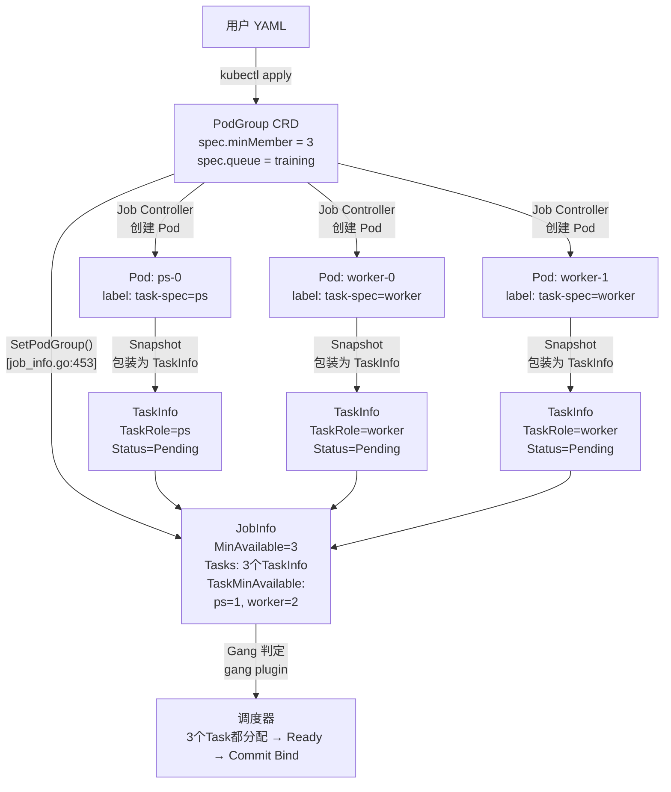

# Volcano 核心概念：Job / Task / Pod 的关系

## 目录

1. [概述](#1-概述)
2. [核心数据结构](#2-核心数据结构)
3. [关系图](#3-关系图)
4. [生命周期对照](#4-生命周期对照)
5. [具体例子](#5-具体例子)
6. [常见混淆点](#6-常见混淆点)

---

## 1. 概述

在 Volcano 调度器的源码中，Job、Task、Pod 是三个不同层面的概念。理解它们之间的关系是阅读调度器源码的前提。

简短定义：

| 概念 | 是什么 | 在哪定义 | 类比 |
|------|--------|---------|------|
| **Pod** | K8s 原生对象，最终在节点上运行的容器组 | `k8s.io/api/core/v1` | 饺子皮 |
| **TaskInfo** | 调度器对 Pod 的包装：Pod + 资源需求 + 调度状态 | [`job_info.go:118`](pkg/scheduler/api/job_info.go#L118) | 饺子 |
| **JobInfo** | 一组 Task 的集合，Gang 调度的基本单元 | [`job_info.go:363`](pkg/scheduler/api/job_info.go#L363) | 一口锅 |
| **PodGroup** | 用户提交的配置 CRD，定义 MinMember 等参数 | [`types.go:173`](../../staging/src/volcano.sh/apis/pkg/apis/scheduling/v1beta1/types.go#L173) | 菜谱 |

---

## 2. 核心数据结构

### 2.1 Pod — K8s 原生对象

标准 `v1.Pod`，由 Volcano Job Controller 创建，存储在 API Server 中，最终被调度器 Bind 到节点。调度器通过 `TaskInfo.Pod` 持有其引用。

### 2.2 TaskInfo — 调度层包装

[`job_info.go:118-161`](pkg/scheduler/api/job_info.go#L118)：

```go
type TaskInfo struct {
    UID      TaskID
    Job      JobID          // 指向所属 Job
    Name     string
    TaskRole string         // "ps" / "worker"，来自 label volcano.sh/task-spec
    Resreq   *Resource      // 来自 Pod.Spec.Containers[0].Resources.Requests
    Pod      *v1.Pod        // 持有原始 K8s Pod 引用
    TransactionContext       // 嵌入：NodeName, Status, EvictionOccurred
    LastTransaction *TransactionContext  // 上一轮事务的上下文
    Priority int32
    BestEffort bool
    SchGated  bool
    // ...
}
```

**TaskInfo 不是 Pod 的子类，而是 Pod 的"壳"** — 它在 Pod 之上加了调度器需要的所有元数据。

### 2.3 JobInfo — Task 集合

[`job_info.go:363-409`](pkg/scheduler/api/job_info.go#L363)：

```go
type JobInfo struct {
    UID          JobID
    Name         string
    Queue        QueueID
    MinAvailable int32                 // 来自 PodGroup.Spec.MinMember
    Tasks        TasksMap              // map[TaskID]*TaskInfo，全量
    TaskStatusIndex map[TaskStatus]TasksMap  // 按状态分组索引
    TaskMinAvailable map[string]int32  // 每种 TaskRole 需要的最少 Pod 数
    PodGroup     *PodGroup             // 指向 PodGroup CRD
    // ...
}
```

### 2.4 PodGroup — 用户配置 CRD

[`types.go:173-179`](../../staging/src/volcano.sh/apis/pkg/apis/scheduling/v1beta1/types.go#L173)：

```go
type PodGroupSpec struct {
    MinMember int32  // 最少几个 Task 就绪才能跑
    Queue     string // 属于哪个 Queue
    // ...
}
```

---

## 3. 关系图



---

## 4. 生命周期对照

| 阶段 | Pod | TaskInfo | JobInfo |
|------|-----|---------|---------|
| 创建 | Job Controller 创建 Pod，存入 API Server | 快照时从 Pod 构造 `api.NewTaskInfo(pod)` | `NewJobInfo(uid, tasks...)` |
| 调度 | — | allocate action 改变 `Status` | gang plugin 检查 `MinAvailable` |
| 分配节点 | `Spec.NodeName` 被设置 | `Status = Allocated`，`NodeName` 被设置 | — |
| Bind | API Server 收到 Bind 请求 | `Status = Binding → Bound` | — |
| 运行 | 容器启动 | `Status = Running` | — |
| 完成 | Pod 进入 Succeeded/Failed | `Status = Succeeded` | `OnSessionClose` 更新 PodGroup Condition |

**关键**：Pod 和 TaskInfo 是同一个实体的两个视角。Pod 是 K8s 视角（持久化在 API Server），TaskInfo 是调度器视角（在 Session 内存中）。

---

## 5. 具体例子

用户提交一个 TensorFlow 训练 Job，`MinMember=3`：

```
用户 YAML:
  PodGroup: minMember=3, queue=training
  TaskSpec:
    - name: ps, replicas: 1
    - name: worker, replicas: 2

Volcano Job Controller 创建 3 个 Pod:
  ps-0     → Pending, label: volcano.sh/task-spec=ps
  worker-0 → Pending, label: volcano.sh/task-spec=worker
  worker-1 → Pending, label: volcano.sh/task-spec=worker

调度器 Snapshot → JobInfo:
  Name: "training-job"
  MinAvailable: 3
  Queue: "training"
  Tasks: {
    "ps-0":     TaskInfo{TaskRole: "ps",     Status: Pending, Resreq: {cpu:2, mem:4Gi}}
    "worker-0": TaskInfo{TaskRole: "worker", Status: Pending, Resreq: {cpu:4, mem:8Gi}}
    "worker-1": TaskInfo{TaskRole: "worker", Status: Pending, Resreq: {cpu:4, mem:8Gi}}
  }
  TaskStatusIndex: {
    Pending: {ps-0, worker-0, worker-1}
  }
  TaskMinAvailable: {
    "ps": 1, "worker": 2
  }

调度过程:
  1. gang.JobValid(job) → true（3个Pod都存在，≥MinAvailable=3，≥TaskMinAvailable）
  2. allocate: ps-0 → Allocated, worker-0 → Allocated, worker-1 → Allocated
  3. gang.JobReady(job) → true（3个Ready, ≥MinAvailable=3）
  4. stmt.Commit() → 三个Pod同时Bind到节点
```

---

## 6. 常见混淆点

### TaskRole 从哪来？

`TaskRole` 来自 Pod 的 label `volcano.sh/task-spec`。这是 Volcano Job Controller 创建 Pod 时根据 TaskSpec 中的 `name` 字段写入的。

[`job_info.go:621`](pkg/scheduler/api/job_info.go#L621)：

```go
task.TaskRole = task.Pod.Labels[schedulingv1beta1.TaskSpecKey]
```

### Tasks vs TaskStatusIndex

- `JobInfo.Tasks` — 所有 Task 的平铺 map，`TaskID → *TaskInfo`，包含全生命周期
- `JobInfo.TaskStatusIndex` — 按 `TaskStatus` 分组，如 `TaskStatusIndex[Pending]` 只返回 Pending 状态的 Task

调度器通常不直接遍历 `Tasks`，而是通过 `TaskStatusIndex[Pending]` 获取待调度 Task。

### Pod 的 annotation vs label

- `JobInfo.SetPodGroup()` 从 Pod label 读取 `volcano.sh/task-spec` 确定 TaskRole
- 插件（如 model-locality）从 `TaskInfo.Pod.Annotations` 读取用户自定义配置
- `util.BuildPod()` 测试辅助函数把自定义参数放在 `labels` 中，注解放在 `annotations[groupName]` 中

---

*文档生成日期：2026-06-21*
*基于 Volcano 源码分析*
