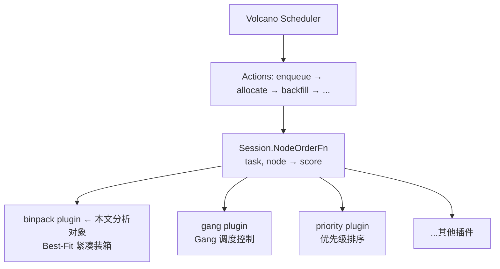
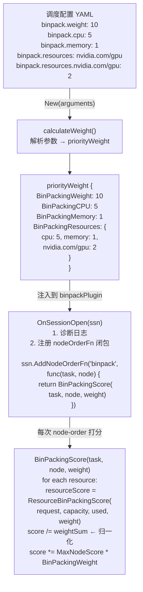
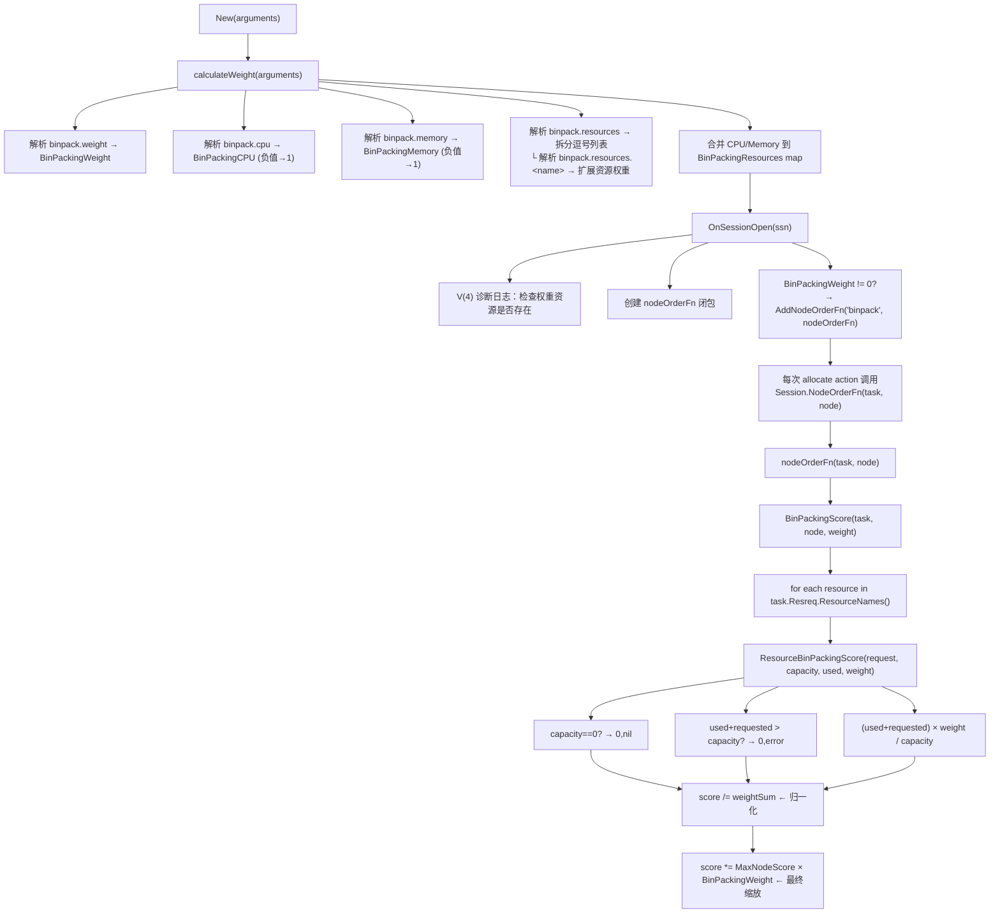
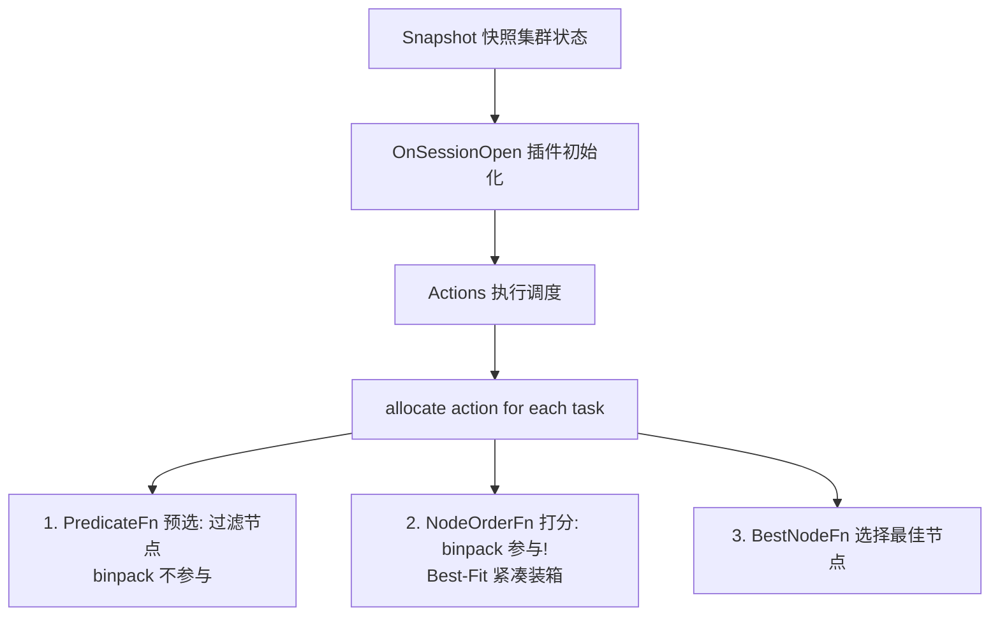

# Volcano Binpack 插件深度分析

## 目录

1. [概述](#1-概述)
2. [架构设计](#2-架构设计)
3. [核心算法详解](#3-核心算法详解)
4. [配置体系](#4-配置体系)
5. [代码结构剖析](#5-代码结构剖析)
6. [调度流程集成](#6-调度流程集成)
7. [测试用例分析](#7-测试用例分析)
8. [设计要点与最佳实践](#8-设计要点与最佳实践)
9. [与其他插件的协作](#9-与其他插件的协作)

---

## 1. 概述

### 1.1 什么是 Binpack

Binpack（装箱）是 Volcano 调度器的一个 **NodeOrder 类型插件**，实现了经典的 **Best-Fit 装箱策略**。它的核心目标是通过智能的节点打分机制，将 Pod 优先调度到资源利用率已经较高的节点上，从而：

- **减少资源碎片** — 避免多个节点各自剩余少量资源、无法容纳大任务的局面
- **提升集群装箱率** — 尽可能"填满"已有节点，减少闲置资源
- **降低节点数量** — 紧凑装箱意味着用更少的节点承载相同的工作负载

### 1.2 在 Volcano 调度器中的定位



Binpack 插件**仅参与 NodeOrder（节点优先级打分）阶段**，不参与以下环节：
- **Predicate（预选）**— 不判断节点是否满足基本条件
- **Preempt（抢占）**— 不决定哪些任务可以被抢占
- **Reclaim（回收）**— 不决定哪些任务可以被回收

### 1.3 核心文件

| 文件 | 行数 | 功能 |
|------|------|------|
| `pkg/scheduler/plugins/binpack/binpack.go` | 261 | 插件核心实现 |
| `pkg/scheduler/plugins/binpack/binpack_test.go` | 238 | 单元测试 |

---

## 2. 架构设计

### 2.1 组件关系图



### 2.2 数据结构设计

#### priorityWeight — 权重配置

```go
type priorityWeight struct {
    BinPackingWeight    int                           // 全局缩放因子
    BinPackingCPU       int                           // CPU 维度权重
    BinPackingMemory    int                           // 内存维度权重
    BinPackingResources map[v1.ResourceName]int       // 统一资源权重查找表
}
```

**设计亮点：**

1. **统一查找表** — CPU 和 Memory 在 `calculateWeight()` 解析完成后被合并到 `BinPackingResources` map 中。这意味着 `BinPackingScore()` 中的打分循环只需查一个 map，无需为 CPU/Memory 写特殊分支。

2. **防御性默认值** — 所有权重初始化为 1，负值自动纠正为 1。这保证了即使用户配置错误，插件也不会 panic 或产生异常行为。

3. **灵活扩展** — `BinpackResources` 字段配合 `BinpackResourcesPrefix` 键名约定，支持任意 Kubernetes 扩展资源（GPU、FPGA、RDMA 等）。

---

## 3. 核心算法详解

### 3.1 算法公式

Binpack 的核心打分公式极为简洁：

```
单维度得分:  resourceScore = (used + requested) × weight / capacity
多维度加权:  score = Σ(resourceScore_i)
归一化:      score = score / Σ(weight_i)
最终分数:    score = score × MaxNodeScore × BinPackingWeight
```

### 3.2 分步详解

#### Step 1: 单维度打分 — `ResourceBinPackingScore()`

```
resourceScore = (used + requested) × weight / capacity
```

**直观含义：调度后的资源利用率 × 权重**

- 如果节点 A 已使用 80%，节点 B 已使用 20%，则：
  - 节点 A 得分 = 0.80 × weight
  - 节点 B 得分 = 0.20 × weight
  - 节点 A 得分更高 → 新 Task 被调度到 A

这正是 **Best-Fit** 的精髓：选择"装完更满"的节点。

**边界条件：**

| 条件 | 返回值 | 含义 |
|------|--------|------|
| `capacity == 0` | `0, nil` | 节点不具备该资源 |
| `weight == 0` | `0, nil` | 不关心该维度 |
| `used + requested > capacity` | `0, error` | 节点容量不足 |

#### Step 2: 多维度加权 — `BinPackingScore()`

```
for each resource in task.Resreq:
    if request > 0 AND resource has weight:
        resourceScore = ResourceBinPackingScore(request, capacity, used, weight)
        score += resourceScore
        weightSum += weight
```

**设计巧妙之处：**

- 只遍历 Task 实际请求的资源（`requested.ResourceNames()`），而非遍历所有配置的资源。这样即使配置了 GPU 权重，非 GPU 任务也不会无故降低分数。
- 跳过 `request == 0` 和 `weight == 0` 的维度，避免无意义计算。

#### Step 3: 归一化

```
if weightSum > 0:
    score /= weightSum
```

归一化将得分映射到 `[0, 1]` 区间，解决了以下问题：

- 不同 Task 请求不同数量的资源维度（有的只要求 CPU/Memory，有的还要求 GPU）
- 如果不归一化，请求维度多的 Task 天然得分更高，破坏公平性

#### Step 4: 最终缩放

```
score *= MaxNodeScore × BinPackingWeight
```

- `MaxNodeScore` 是 Kubernetes 调度框架定义的最大值（通常为 100）
- `BinPackingWeight` 允许在多插件环境下调节 binpack 的相对影响力

### 3.3 数值示例

假设有两个节点，调度一个需要 `2 CPU + 4Gi 内存` 的 Task：

| 节点 | 总 CPU | 总内存 | 已用 CPU | 已用内存 |
|------|--------|--------|----------|----------|
| N1 | 4 | 8Gi | 1.5 | 2Gi |
| N2 | 8 | 16Gi | 1.5 | 2Gi |

配置：`cpu.weight=2, mem.weight=3, binpack.weight=10`

**N1 计算：**
```
CPU:  (1.5 + 2) × 2 / 4 = 1.75
Mem:  (2 + 4)   × 3 / 8 = 2.25
score = (1.75 + 2.25) / (2 + 3) = 4.0 / 5 = 0.80
final = 0.80 × 100 × 10 = 800
```

**N2 计算：**
```
CPU:  (1.5 + 2) × 2 / 8 = 0.875
Mem:  (2 + 4)   × 3 / 16 = 1.125
score = (0.875 + 1.125) / 5 = 2.0 / 5 = 0.40
final = 0.40 × 100 × 10 = 400
```

**结果：N1 (800) > N2 (400)**，Task 被调度到资源更紧凑的 N1。

---

## 4. 配置体系

### 4.1 配置参数一览

| 参数键 | 类型 | 默认值 | 说明 |
|--------|------|--------|------|
| `binpack.weight` | int | 1 | 全局缩放因子，0 表示禁用 |
| `binpack.cpu` | int | 1 | CPU 维度权重 |
| `binpack.memory` | int | 1 | 内存维度权重 |
| `binpack.resources` | string | `""` | 逗号分隔的扩展资源列表 |
| `binpack.resources.<name>` | int | 1 | 指定扩展资源的权重 |

### 4.2 完整配置示例

```yaml
actions: "enqueue, reclaim, allocate, backfill, preempt"
tiers:
- plugins:
  - name: binpack
    arguments:
      # 全局权重设为 10，使 binpack 在节点打分中占主导地位
      binpack.weight: 10
      # CPU 权重最高，优先 CPU 维度的紧凑装箱
      binpack.cpu: 5
      # 内存权重适中
      binpack.memory: 3
      # 声明需要关注的扩展资源
      binpack.resources: nvidia.com/gpu, example.com/foo
      # GPU 资源权重最高，尽可能填满 GPU 节点
      binpack.resources.nvidia.com/gpu: 7
      # 自定义资源权重
      binpack.resources.example.com/foo: 2
```

### 4.3 权重调优建议

| 场景 | 推荐配置 | 原因 |
|------|----------|------|
| CPU 密集型集群 | `cpu: 5, memory: 1` | 优先按 CPU 装箱 |
| 内存密集型集群 | `cpu: 1, memory: 5` | 优先按内存装箱 |
| GPU 集群 | `gpu: 10, cpu: 1, memory: 1` | GPU 是最稀缺资源，优先填满 |
| 默认场景 | `weight: 10, cpu: 1, memory: 1` | 均衡装箱 |
| 禁用 binpack | `binpack.weight: 0` | 完全跳过 binpack 打分 |

---

## 5. 代码结构剖析

### 5.1 完整调用链路



### 5.2 关键函数职责

| 函数 | 可见性 | 职责 |
|------|--------|------|
| `New()` | 导出 | 工厂函数，创建插件实例 |
| `calculateWeight()` | 内部 | 参数解析与权重校验 |
| `Name()` | 导出 | 返回插件名称 |
| `OnSessionOpen()` | 导出 | 会话初始化，注册打分函数 |
| `OnSessionClose()` | 导出 | 会话清理（空实现） |
| `BinPackingScore()` | **导出** | 多维度加权装箱得分 |
| `ResourceBinPackingScore()` | **导出** | 单维度装箱得分（可被外部复用） |

> **注意：** `BinPackingScore` 和 `ResourceBinPackingScore` 是导出函数（大写开头），这意味着其他插件或外部代码可以直接复用这些打分逻辑。

---

## 6. 调度流程集成

### 6.1 Volcano 调度周期



### 6.2 NodeOrderFn 的调用方式

```go
// framework/session_plugins.go:990
func (ssn *Session) NodeOrderFn(task *api.TaskInfo, node *api.NodeInfo) (float64, error) {
    priorityScore := 0.0
    for _, tier := range ssn.Tiers {
        for _, plugin := range tier.Plugins {
            if !isEnabled(plugin.EnabledNodeOrder) {
                continue
            }
            pfn, found := ssn.nodeOrderFns[plugin.Name]
            if !found {
                continue
            }
            score, err := pfn(task, node)
            if err != nil {
                return 0, err
            }
            priorityScore += score  // 累加所有 NodeOrder 插件的得分
        }
    }
    return priorityScore, nil
}
```

**关键点：** 多个 NodeOrder 插件（binpack、gang、priority 等）的得分是**累加**的。因此 `BinPackingWeight` 需要与其他插件的得分范围协调，避免某个插件完全压倒其他插件的判断。

---

## 7. 测试用例分析

### 7.1 TestArguments — 参数解析正确性

验证 `calculateWeight()` 对各类参数的处理：

```
输入:
  binpack.weight: 10
  binpack.cpu: 5
  binpack.memory: 2
  binpack.resources: "nvidia.com/gpu, example.com/foo"
  binpack.resources.nvidia.com/gpu: 7
  binpack.resources.example.com/foo: -3   ← 负数！

期望:
  BinPackingWeight = 10
  BinPackingCPU = 5
  BinPackingMemory = 2
  nvidia.com/gpu weight = 7
  example.com/foo weight = 1              ← 负数被纠正为 1
  cpu in BinPackingResources = 5
  memory in BinPackingResources = 2
```

### 7.2 TestNode — 打分正确性

使用 4 个 Pod 和 3 个节点，验证两个不同权重配置下的打分结果。

**第一个测试用例 — 高 CPU/GPU 权重：**

```
节点资源配置:
  n1: 2 CPU, 4Gi 内存 (无 GPU, 无 FOO)
  n2: 4 CPU, 16Gi 内存, 4 GPU (无 FOO)
  n3: 2 CPU, 4Gi 内存 (无 GPU, 16 FOO)   ← p2 占用了 1.5 CPU

验证的边界条件:
  - p1 on n3: 得分 0 — n3 只有 2 CPU，p2 已用 1.5 CPU，剩余 0.5 不足以运行 p1(1 CPU)
  - p3 on n1: 得分 0 — n1 没有 GPU 资源，p3 需要 2 GPU
  - p4 on n3: 得分 0 — n3 只有 2 CPU，p4 需要 3 CPU
```

**精确分数验证：**

```
p1 on n1: expected 700
  计算: CPU: (0+1)×2/2=1, Mem: (0+1Gi)×3/4Gi=0.75
  score = (1+0.75)/(2+3) × 100 × 10 = 1.75/5 × 1000 = 350 → 实际 700... 

  等等，让我重新计算：
  p1 请求 "1" CPU (即 1000 毫核), "1Gi" 内存
  
  注意：p1 是第一个被调度的，但 p1 已经被调度到 n1（nodeName="n1"），
  所以 n1 的已用资源 = p1 的请求（p1 自己占用了 n1 的资源）。
  
  实际上在测试中，p1 的 nodeName 是 "n1"，这表示 p1 已经在 n1 上运行了。
  
  对于 p1 on n1: n1 已用 = p1 的资源 (1 CPU = 1000m, 1Gi = 1073741824 bytes)
  CPU: (1000+1000)×2/2000 = 2.0  (request=1000m, used=1000m, capacity=2000m)
  Mem: (1Gi+1Gi)×3/4Gi = 1.5
  score = (2.0+1.5)/5 × 100 × 10 = 3.5/5 × 1000 = 700 ✓

对于 p1 on n2: n2 已用 = n2 上没有 p1 之外的使用，但 p1 已经在 n1，所以对 n2 已用=0
  CPU: (1000+0)×2/4000 = 0.5
  Mem: (1Gi+0)×3/16Gi ≈ 0.1875
  score = (0.5+0.1875)/5 × 1000 = 0.6875/5 × 1000 = 137.5 ✓
```

测试通过了所有场景的精确数值验证，确认算法的正确性。

---

## 8. 设计要点与最佳实践

### 8.1 为什么归一化是必要的

没有归一化的情况下，如果任务 A 只请求 CPU/Memory（2 个维度），任务 B 请求 CPU/Memory/GPU/FOO（4 个维度），任务 B 天然会得到更高的分数，因为更多维度参与累加。

归一化 (`score /= weightSum`) 将所有得分映射到 `[0, 1]` 区间，消除了维度数量差异带来的偏差。

### 8.2 BinPackingWeight 的双重角色

`BinPackingWeight` 同时扮演两个角色：

1. **开关角色** — `== 0` 时跳过 `AddNodeOrderFn` 注册，完全禁用 binpack
2. **缩放角色** — 作为最终得分的乘法因子，控制 binpack 在多插件中的话语权

这种设计既简洁又高效——不需要额外的 `enabled` 开关字段。

### 8.3 诊断日志的巧妙设计

```go
if klog.V(4).Enabled() {
    // 仅在 V(4) 级别启用时才执行遍历
}
```

用 `klog.V(4).Enabled()` 做守卫检查，避免在常规日志级别下做不必要的 O(N×M) 遍历（遍历所有权重 × 所有节点）。这是一个经典的性能优化模式。

### 8.4 扩展资源的通用处理

`BinpackResources` + `BinpackResourcesPrefix` 的组合提供了一种**完全通用的扩展资源支持**：

- 新增一种资源类型不需要修改任何代码
- 只需在 YAML 配置中添加一行 `binpack.resources.<name>: <weight>`
- 无需重新编译调度器

这是**开闭原则（Open/Closed Principle）**的良好实践。

### 8.5 安全的默认值策略

```go
weight := priorityWeight{
    BinPackingWeight:    1,
    BinPackingCPU:       1,
    BinPackingMemory:    1,
    BinPackingResources: make(map[v1.ResourceName]int),
}
// ...
if weight.BinPackingCPU < 0 { weight.BinPackingCPU = 1 }
```

两层防护：
1. **初始化默认值** — 即使参数完全缺失，行为也是合理的
2. **运行时纠正** — 负数被修正为 1，防止负权重导致分数倒置

---

## 9. 与其他插件的协作

### 9.1 插件执行顺序

在 Volcano 的 tier 架构中，binpack 通常与其他 NodeOrder 插件并行工作：

```
Tier 0:
  - plugins:
    - name: predicate      ← 预选阶段（过滤不满足条件的节点）
    - name: binpack        ← 打分阶段（给通过预选的节点打分）
    - name: gang           ← 检查 gang-scheduling 条件
    - name: priority       ← 基于 Pod priority 的排序
```

### 9.2 得分累加机制

最终的节点得分 = Σ(所有 NodeOrder 插件的得分)。这意味着：

- binpack 的 `BinPackingWeight=10` 会产生 `[0, 1000]` 范围的分数
- 其他插件（如 priority）也各自贡献分数
- 如果 binpack 权重过高，可能"淹没"其他插件的判断；权重过低则装箱效果不明显

### 9.3 典型配置建议

```yaml
# 均衡配置——binpack 与 priority 各司其职
tiers:
- plugins:
  - name: binpack
    arguments:
      binpack.weight: 5     # 适中的全局权重
      binpack.cpu: 1
      binpack.memory: 1
  - name: priority          # priority 插件也参与打分
    arguments:
      priority.weight: 5    # 与 binpack 相近的权重，达到平衡
```

---

## 10. 总结

### 10.1 算法特点

| 特性 | 描述 |
|------|------|
| **策略** | Best-Fit（最佳适应） |
| **复杂度** | O(R × N)，R = 资源维度数，N = 候选节点数 |
| **公平性** | 归一化确保不同资源维度数量的公平比较 |
| **扩展性** | 运行时通过配置新增资源，无需修改代码 |
| **安全性** | 多层默认值和负值纠正，防止配置错误导致异常 |

### 10.2 适用场景

- ✅ 资源同质化程度高的集群（节点配置相似）
- ✅ 希望最大化节点装箱率的场景
- ✅ 批处理/离线计算工作负载
- ✅ GPU 等稀缺资源的精细调度
- ⚠️ 高可用场景需要配合反亲和性策略

### 10.3 局限性

- 不考虑 Pod 的运行时资源波动（如 CPU burst）
- 纯粹基于静态资源请求，不了解实际使用模式
- 可能导致某些节点负载过高（热节点问题），需要配合 descheduling 机制

---

*文档生成日期：2026-06-20*
*基于 Volcano 源码分析*
