# Volcano Gang 插件深度分析

## 目录

1. [概述](#1-概述)
2. [核心概念](#2-核心概念)
3. [架构设计](#3-架构设计)
4. [六大扩展点详解](#4-六大扩展点详解)
5. [Job 状态机](#5-job-状态机)
6. [抢占与回收保护](#6-抢占与回收保护)
7. [OnSessionClose 流程](#7-onsessionclose-流程)
8. [完整调度流程中的 Gang](#8-完整调度流程中的-gang)
9. [与 binpack / nodeorder 的协作](#9-与-binpack--nodeorder-的协作)
10. [总结](#10-总结)

---

## 1. 概述

### 1.1 什么是 Gang Scheduling

Gang Scheduling（成组调度）的核心思想：**一个 Job 的所有 Task 必须作为一个整体被调度**。任意一个 Task 无法分配资源，整个 Job 的其他 Task 也应当等待。这类似于分布式事务的 All-or-Nothing 语义。

### 1.2 典型场景

**分布式训练（TensorFlow）**：`MinAvailable=5`，1×PS + 4×Worker，全部启动训练才开始。

**MPI 作业**：`MinAvailable=N`，所有 rank 同时启动，缺一不可。

### 1.3 gang 插件在 Volcano 中的定位

gang 是 Volcano 调度器**最基础、最核心**的插件。与 binpack（打分）和 nodeorder（打分）不同，gang **不参与打分**，而是贯穿整个调度流程的**决策控制层**：

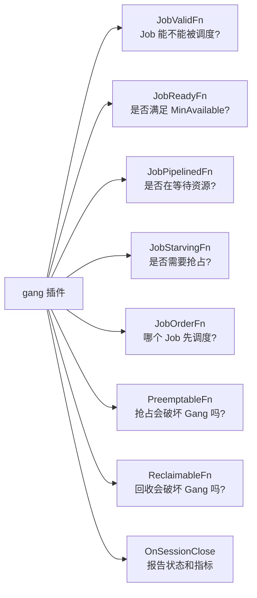

### 1.4 核心文件

| 文件 | 行数 | 功能 |
|------|------|------|
| `gang.go` | 297 | 插件核心实现 |
| `api/job_info.go` | ~1500 | Job/Task 状态管理（Gang 语义的数据基础） |
| `api/sub_job_info.go` | ~300 | SubJob 状态管理 |
| `api/types.go` | ~100 | TaskStatus 枚举定义 |

---

## 2. 核心概念

### 2.1 MinAvailable — Gang 调度的核心参数

```go
// JobInfo
MinAvailable int32  // 来自 PodGroup.Spec.MinMember
```

`MinAvailable` 是 Gang Scheduling 的**唯一核心参数**。它定义了 Job 可以开始运行的最小 Task 数：

- ✓ 有 3+ 个 Task 处于 Ready 状态 → Job Ready → 执行 Bind
- ✗ 只有 2 个 Task Ready → Job 等待 → 要么等资源，要么触发抢占

### 2.2 Task 状态体系

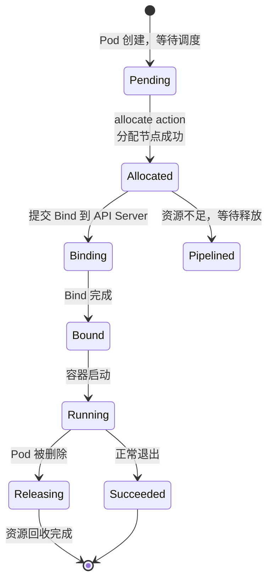

**关键状态分类**：

| 分类 | 包含状态 | 含义 |
|------|----------|------|
| Ready | Bound, Binding, Running, Allocated, Succeeded | 已成功分配/Bind |
| Waiting | Pipelined | 等待资源释放 |
| Pending | Pending | 未分配 |
| Invalid | Failed, Unknown, Releasing | 不可用 |

### 2.3 三层 MinAvailable

Gang 支持三层的最小可用性约束：

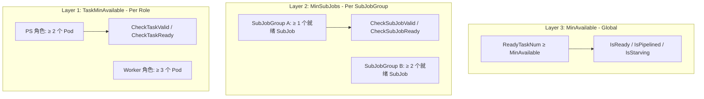

### 2.4 Key Formulas

```go
// IsReady: 已经"赢得"足够资源，可以 Bind
ReadyTaskNum() + PendingBestEffortTaskNum() >= MinAvailable

// IsPipelined: 还在等，但"预期"能满足（有 Pipelined Task）
WaitingTaskNum() + ReadyTaskNum() + PendingBestEffortTaskNum() >= MinAvailable

// IsStarving: 差太多，必须抢占别人
WaitingTaskNum() + ReadyTaskNum() < MinAvailable
```

**对比记忆**：

| 状态 | 条件 | 调度器行为 |
|------|------|-----------|
| Ready | 够 MinAvailable | Bind Pod 到节点 |
| Pipelined | 勉强够（含等待中） | 不 Bind，等资源释放 |
| Starving | 不够 MinAvailable | 触发抢占 |

### 2.5 Pipelined 与 Pending 的本质区别

#### 为什么需要两种状态？

Pending 和 Pipelined 代表了 Task 生命周期中两个完全不同的阶段。理解它们的关键在于 Volcano 的**两级节点选择机制**。

#### Pending → Pipelined 的转换时机

在 `allocate` action 中，调度器为每个 Task 选择节点时，会经历两级梯度：

```go
// allocate.go:933 - 第一梯度：节点 Idle 资源足够
if task.InitResreq.LessEqual(node.Idle, api.Zero) {
    stmt.Allocate(task, node)   // → Status = Allocated（直接分配）
}

// allocate.go:949 - 第二梯度：Idle 不够，但 Idle + Releasing 够
if task.InitResreq.LessEqual(node.FutureIdle(), api.Zero) {
    stmt.Pipeline(task, node.Name, false)  // → Status = Pipelined（排队等待）
}
```

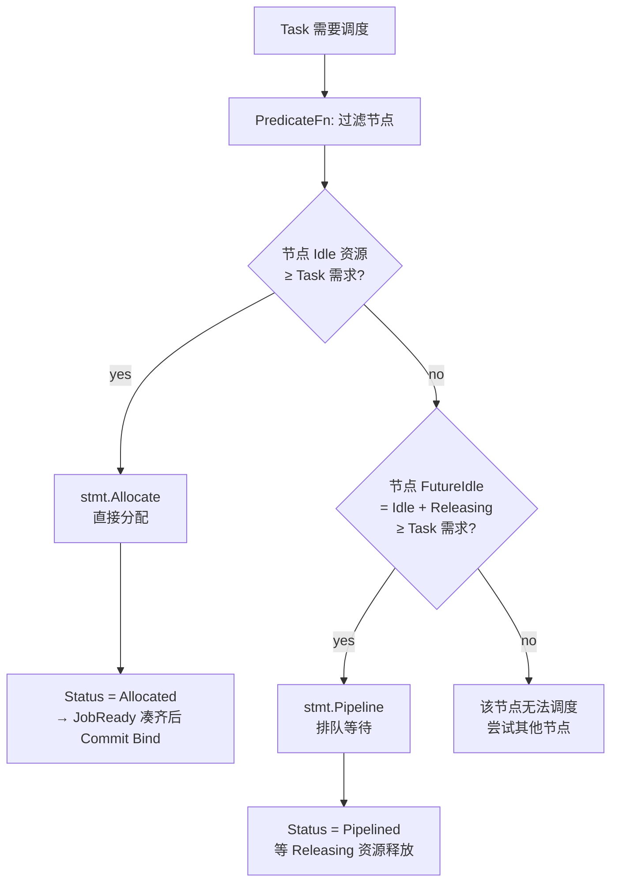

**关键概念**：

| 概念 | 含义 |
|------|------|
| `Idle` | 节点上当前空闲的资源 |
| `Releasing` | 正在释放中的资源（Pod 被标记删除但资源还未回收） |
| `FutureIdle` | `Idle + Releasing` — 预期的未来空闲资源 |

#### 具体示例

```
集群状态:
  n1: 总 4 CPU, Idle=1 CPU, Releasing=2 CPU (一个 Pod 正在被删除)
      FutureIdle = 1 + 2 = 3 CPU

Task A: 需要 1 CPU
  → Idle(1) ≥ 1 ✓ → 第一梯度 → Allocated (立即分配)

Task B: 需要 2.5 CPU
  → Idle(1) < 2.5 ✗ → 第一梯度失败
  → FutureIdle(3) ≥ 2.5 ✓ → 第二梯度 → Pipelined (等 Releasing 释放)
```

| | Pending | Pipelined |
|------|---------|-----------|
| **含义** | Pod 已创建，调度器还没处理 | 调度器已选定节点，等资源释放 |
| **有目标节点吗** | ❌ 没有 | ✅ 已经定了 |
| **什么时候变** | Job Controller 创建 Pod 时 | allocate action 选第二梯度节点时 |
| **下一步** | 等待被 allocate action 处理 | 等 Releasing 资源释放后自动转 Allocated |
| **类比** | 餐厅门口没取号 | 取了号，知道坐哪桌，等那桌客人走 |

#### 为什么 Pipelined 对 Gang 调度至关重要

假设一个 Job 需要 MinAvailable=5，集群只有 3 个节点的 Idle 资源够，但还有 2 个节点的 Releasing 资源加上 Idle 也够。

- **如果没有 Pipelined**：3 个 Task → Allocated，剩下 2 个 Task 无处可去。`JobReady` 检查: 3 < 5 → false。整个 Job 这轮调度失败，之前已经分配好的 3 个也要回滚。
- **有了 Pipelined**：3 个 Task → Allocated，2 个 Task → Pipelined（等待 Releasing 释放）。`JobPipelined` 检查: 3+2 ≥ 5 → true。分配方案保留，等资源到位就能立刻 Bind。

Pipelined 就是 Volcano 的"**先占座，等清台**"机制——避免因为瞬时的资源紧张导致整个 Gang 调度失败。

---

## 3. 架构设计

### 3.1 组件关系图

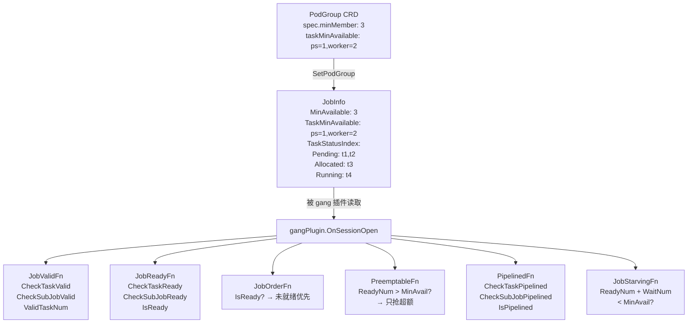

### 3.2 数据结构

```go
type gangPlugin struct {
    pluginArguments framework.Arguments  // 预留参数（当前未使用）
}
```

gang 插件的结构体极简——只有一个预留参数字段。因为它的所有行为都由 `PodGroup.Spec.MinMember` 控制，不需要插件级别的 YAML 配置。

---

## 4. 六大扩展点详解

### 4.1 JobValidFn — 准入控制（第一道门）

**触发时机**：每次调度周期开始（enqueue action），对每个 Job 调用。

#### 判定的到底是什么？

> **核心澄清**：`JobValid` 检查的不是"Task 已经被调度到了节点上"，而是"存在多少个**可用的** Pod 对象"。"可用"的定义比"已调度"宽泛得多。

源码中 `CheckTaskValid` 的统计范围：

```go
for status, tasks := range ji.TaskStatusIndex {
    if AllocatedStatus(status) ||   // Bound, Binding, Running, Allocated
        status == Succeeded ||       // 已完成
        status == Pipelined ||       // 等待资源释放
        status == Pending {          // 未调度的新 Pod
        // ↑ 以上四种状态的 Task 都算"可用"
        for _, task := range tasks {
            actual[task.TaskRole]++
        }
    }
}
```

四种被计数的状态，分别对应四个完全不同的场景。下面逐个拆解。

---

#### 四种"可用"状态详解

##### 1. Pending — "刚创建，还没调度"

**是什么**：Volcano Job Controller 提前为 Job 创建好的 Pod，状态为 Pending，正等待调度器分配节点。

**典型场景**：一个全新的 Job，刚提交到集群。

```
Job training-job (MinAvailable=5, TaskMinAvailable: {ps:2, worker:3})
刚创建，所有 5 个 Pod 都在 Pending 状态：

  Pod 状态:
    ps-0     → Pending  ✓ 计入
    ps-1     → Pending  ✓ 计入
    worker-0 → Pending  ✓ 计入
    worker-1 → Pending  ✓ 计入
    worker-2 → Pending  ✓ 计入

  PS 角色:    2 Pending → ≥ 2 ✓
  Worker 角色: 3 Pending → ≥ 3 ✓
  → JobValid = true，开始调度！
```

##### 2. Pipelined — "已经定了节点，但资源还没腾出来"

**是什么**：Pipelined 是 Volcano 的"透支"机制。当集群资源不够时，调度器不会直接让 Task 失败，而是把它设为 Pipelined：**已经选好了目标节点，但那个节点的资源还被其他 Task 占着，需要等抢占/回收释放资源**。

**类比**：餐厅满座了，你取了号，服务员告诉你会坐哪张桌子，但这张桌子现在的客人还没吃完。你"已经在排队等那张桌子"——这就是 Pipelined。

**为什么 Pipelined 算"可用"？** 因为调度器已经为它找到了节点，它在"等待队列"里，而不是"无处可去"。如果下一轮资源释放了，它就会变成 Allocated → Running。

**典型场景**：

```
Job training-job (MinAvailable=5, TaskMinAvailable: {ps:2, worker:3})
第一轮调度：集群只有 3 个节点的资源够用

  调度结果:
    ps-0     → Allocated (分配到 n1)
    ps-1     → Allocated (分配到 n2)
    worker-0 → Allocated (分配到 n3)
    worker-1 → Pipelined (目标 n1，等 n1 上的低优 Task 被抢占)
    worker-2 → Pipelined (目标 n2，等 n2 上的低优 Task 被抢占)

  第二轮 JobValid 检查:
    PS 角色:    2 Allocated → ≥ 2 ✓
    Worker 角色: 1 Allocated + 2 Pipelined = 3 → ≥ 3 ✓
    → JobValid = true ← Pipelined 被计入，Job 不会被误判为"不可用"
```

如果没有 Pipelined 的计入，Worker 会显示只有 1 个"可用"，不满足 TaskMinAvailable=3，Job 会被错误地标记为 `NotEnoughPodsOfTask`，之前调度好的 3 个 Task 也白费了。

##### 3. Succeeded — "已经跑完了，也算"

**是什么**：Task 对应的 Pod 已经成功运行完毕（容器正常退出码 0）。

**为什么要算？** 一个 Job 中的不同 Task 可能有不同的生命周期。某些 Task 先完成，某些长时间运行。已完成的 Task 已经完成了它在 Gang 中的职责，应当计入角色的配额。

**典型场景一：参数服务器先行完成**

```
Job training-job (MinAvailable=5, TaskMinAvailable: {ps:2, worker:3})
PS 负责提供参数，Worker 负责训练。训练跑完后 PS 自然退出。

  第 N 轮调度后的状态:
    ps-0     → Succeeded  (参数服务完成，正常退出)
    ps-1     → Succeeded  (参数服务完成，正常退出)
    worker-0 → Running
    worker-1 → Running
    worker-2 → Running

  用户更新了 PodGroup（比如扩容 Worker），触发新一轮 JobValid:
    PS 角色:    2 Succeeded → ≥ 2 ✓  ← 已完成也算！
    Worker 角色: 3 Running → ≥ 3 ✓

  如果不算 Succeeded，PS 角色 = 0，JobValid 会失败！
```

**典型场景二：init container 类 Task 已完成**

```
Job data-pipeline (MinAvailable=3, TaskMinAvailable: {loader:1, processor:2})

  loader-0  → Succeeded  (数据加载完成就退出了)
  processor-0 → Running
  processor-1 → Running

  loader 角色: 1 Succeeded → ≥ 1 ✓
  processor 角色: 2 Running → ≥ 2 ✓
```

##### 4. AllocatedStatus — "正在运行或已经分配"

**是什么**：包含四个子状态：`Allocated`（已分配节点）、`Binding`（正在绑定）、`Bound`（已绑定）、`Running`（容器运行中）。

这是最常规的"可用"——Task 已经被调度器分配了节点并且正在运行或准备运行。

---

#### 一句话总结

| 状态 | 含义 | 为什么算"可用" |
|------|------|---------------|
| **Pending** | Pod 已创建，等调度 | Pod 对象存在，只是还没分配节点 |
| **Pipelined** | 已定节点，等资源释放 | 调度器已承诺分配，在排队等待 |
| **Succeeded** | 已成功完成 | 已完成 Gang 职责，计入角色配额 |
| **Allocated/Bound/Running** | 正在运行或已分配 | 常规"已调度"状态 |

**JobValid 的本质问题**：这个 Job 的各个角色，Pod 数量够不够？——不是"调度了没"，而是"存在没（含已完成和排队中的）"。

#### 失败示例

```
Job training-job: MinAvailable=5, TaskMinAvailable: {ps:2, worker:3}

实际 Pod 状态:
  PS 角色:    1 Pending + 1 Running = 2 → ≥ 2 ✓
  Worker 角色: 2 Pending = 2           → < 3 ✗  ← 差 1 个！

→ JobValid = false, Reason = NotEnoughPodsOfTask
```

这通常发生在：
- Job Controller 还在逐步创建 Pod（Worker 只创建了 2 个，差 1 个）
- 某些 Worker Pod 被意外删除（总数不够）
- 用户修改了 `TaskMinAvailable` 但 Pod 数量跟不上

### 4.2 JobReadyFn — 就绪判定（决定是否 Commit Bind）

#### "Ready" 到底是什么意思？

> **核心澄清**：`JobReady` 中的 "Ready" **不是指 Pod 已经在节点上跑起来了**，而是指 **调度器内部已经为足够多的 Task 选定了节点（Allocated 状态），可以提交 Bind 了**。

在 Volcano 的调度模型中，分配和绑定是两个阶段：

```
Pending → 调度器选节点 → Allocated → Commit → Binding → Bound → Running
                              ↑                        ↑
                         JobReady 检查的是这里       真正 Bind 发生在这里
```

`Allocated` 状态意味着调度器在内部事务中**已经决定了 Task 去哪个节点**，但还没真正执行 Bind。`JobReady` 检查的就是：**"内部事务中，够不够 MinAvailable 个 Task 被成功分配了节点？"**

#### 为什么需要 JobReady？

这直接关系到 allocate action 的 **Commit 决策**。源码：

```go
// allocate.go:330
stmt := alloc.allocateResourcesForTasks(subJob, tasks, ...)
if stmt != nil && ssn.JobReady(job) {
    stmt.Commit()   // ← 只有 JobReady 才真正提交 Bind！
}
```

以及 Pipelined 路径（allocate.go:401）：

```go
if ssn.JobReady(job) || ssn.JobPipelined(job) {
    stmtBackup[hyperNode.Name] = mergedStmt  // ← Ready 或 Pipelined 才保存方案
}
// 注意：Pipelined 只保存不 Commit！只有 Ready 才 Commit！
```

决策矩阵：

| JobReady | JobPipelined | 行为 |
|----------|-------------|------|
| true | — | **Commit** → 提交 Bind，Task 真正绑定到节点 |
| false | true | **保存方案但不 Commit** → 等资源释放 |
| false | false | **Discard** → 丢弃方案，回滚分配 |

#### 举个例子说明完整的判断链

```
Job training-job: MinAvailable=3 (3 个 Worker)

第一轮调度:
  集群 Idle 资源: n1 够, n2 够, n3 不够（只有 FutureIdle 够）

  allocate action:
    worker-0 → n1 Idle 够 → Allocated
    worker-1 → n2 Idle 够 → Allocated
    worker-2 → n3 Idle 不够, FutureIdle 够 → Pipelined

  JobReadyFn 检查:
    CheckTaskReady: Worker AllocatedTaskNum=2 < TaskMinAvailable=3 → ✗
    → JobReady = false

  JobPipelinedFn 检查:
    CheckTaskPipelined: Worker Allocated(2)+Pipelined(1)=3 ≥ 3 → ✓
    IsPipelined: Waiting(1)+Ready(2)=3 ≥ MinAvailable(3) → ✓
    → JobPipelined = true

  → 保存分配方案（stmtBackup），但不 Commit
  → worker-0 和 worker-1 不会真正 Bind，等 worker-2 的资源到位

--- n3 上的 Releasing 资源被释放后 ---

第二轮调度:
  worker-2 → n3 Idle 现在够了 → Allocated

  JobReadyFn 检查:
    CheckTaskReady: Worker AllocatedTaskNum=3 ≥ 3 → ✓
    CheckSubJobReady: ✓
    IsReady: ReadyTaskNum=3 ≥ MinAvailable(3) → ✓
    → JobReady = true!

  → Commit! 三个 worker 同时 Bind 到各自节点
  → Gang 语义满足：三个 Worker 同时启动
```

#### 判定逻辑

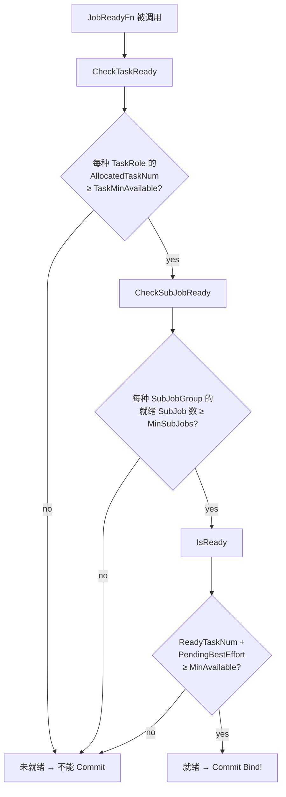

**JobReady vs JobValid vs JobPipelined 决策链**：

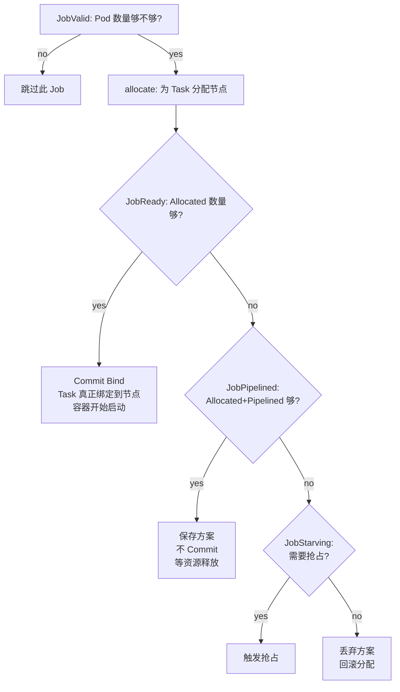

**关键差异**：`CheckTaskReady` 只统计"已分配"（Allocated 状态及以上），不包括 Pipelined 和 Pending。而 `CheckTaskValid` 统计更宽松，包括 Pipelined 和 Pending。

### 4.3 JobPipelinedFn — Pipeline 状态判定（透支机制）

**触发时机**：Job 在 Ready 检查失败时，回退检查 Pipelined。

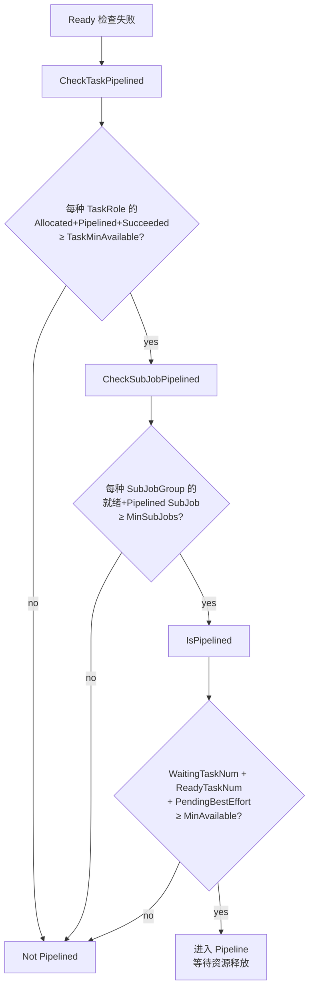

**Pipeline 与 Ready 的差异**：

| 维度 | Ready | Pipelined |
|------|-------|-----------|
| 计数范围 | Ready tasks only | Ready + Pipelined tasks |
| 能否 Bind | ✓ 可以 | ✗ 不能（资源还没到位） |
| 含义 | 已满足 MinAvailable | 预期未来能满足 |

### 4.4 JobOrderFn — Job 优先级排序

#### 先搞清楚两个概念

**"就绪"（Ready）**：Job 已经有 ≥ MinAvailable 个 Task 处于 Allocated/Bound/Running 状态。这个 Job 的 Gang 条件已经满足了，随时可以 Commit Bind。

**"未就绪"（Not Ready）**：Job 的 Allocated/Bound/Running Task 数量 < MinAvailable。还有 Pending Task 需要分配节点才能满足 Gang 条件。

#### 源码层面的完整逻辑链

先从 `allocateResources` 的外层循环看起——**这决定了 Job 排序到底影响什么**：

```go
// allocate.go:283-348
func (alloc *Action) allocateResources(actx *allocateContext) {
    queues := actx.queues
    for {
        if queues.Empty() { break }          // ① 处理完所有 Queue 才退出

        queue := queues.Pop().(*api.QueueInfo)
        jobs, _ := actx.jobsByQueue[queue.UID]
        job := jobs.Pop().(*api.JobInfo)      // ② 从 Queue 中 Pop 一个 Job

        // 注：jobs 是一个 PriorityQueue，排序规则由 JobOrderFn 决定

        stmt := alloc.allocateResourcesForTasks(subJob, tasks, ...)
        if stmt != nil && ssn.JobReady(job) {  // ③ 只有 JobReady 才 Commit
            stmt.Commit()
            if tasks.Len() > 0 {
                jobs.Push(job)                 // ④ 还有 Pending Task → 推回队列
            }
        }

        queues.Push(queue)                     // ⑤ Queue 推回，下一轮可能再 Pop
    }
}
```

关键事实：

1. **循环处理所有 Queue 和所有 Job**，不是只处理前 N 个——所以不存在"排到第 9999 位就永远轮不到"
2. **每次迭代只 Pop 一个 Job**，处理完 Push 回 Queue，然后 Pop 下一个（可能是同一个 Queue 的另一个 Job，也可能换 Queue）
3. **只有 `JobReady` 才 `Commit`**——Pipelined 状态的 stmt 不会被 Commit，直接丢弃

#### 一个 Ready Job 进入 allocateResourcesForTasks 会发生什么？

```go
// allocateResourcesForTasks 核心逻辑
for !tasks.Empty() {          // ← Ready Job: tasks 是空的！
    task := tasks.Pop()
    // ...分配节点...
}
// 循环不执行，直接跳到判断：

if ssn.SubJobReady(job, subJob) {
    return stmt                 // ← 返回空 stmt（没有任何 Operation）
}
```

回到 `allocateResources`：

```go
stmt := alloc.allocateResourcesForTasks(...)  // 返回的 stmt.operations 为 nil
if stmt != nil && ssn.JobReady(job) {         // JobReady = true
    stmt.Commit()                              // Commit 被调用，但:
                                               //   for _, op := range s.operations { ... }
                                               //   ↑ operations 为空，循环体不执行
    if tasks.Len() > 0 {                       // false，tasks 是空的
        jobs.Push(job)
    }
}
// Job 离开队列，不会再被 Push 回来
```

**所以 Ready Job 的处理就是**：`allocateResourcesForTasks` 返回一个 operations 为空的 stmt，`Commit()` 被调用但 for 循环迭代零次——没有驱逐、没有 Pipeline、没有 Bind。Job 离开队列。

#### 一个 Not-Ready Job 的处理

```
tasks 里有 Pending Task → 进入循环 → 逐个尝试分配节点
→ 消耗节点的 Idle/FutureIdle 资源
→ 如果最终 SubJobReady → 返回 stmt → Commit → 真正绑定
→ 如果最终 SubJobPipelined → 返回 stmt → 不 Commit → stmt 丢弃
→ 如果都不满足 → Discard → 返回 nil → 全部回滚
```

#### 那排序到底影响什么？

**影响的是"谁先消耗有限的 Idle 资源"**。一轮迭代中：

```
Queue 里有 3 个 Job，按 JobOrderFn 排序后：

  Job A (未就绪): tasks 有 2 个 Pending → 进入循环 → 消耗节点 Idle → 可能变成 Ready
  Job B (未就绪): tasks 有 1 个 Pending → 进入循环 → Idle 可能已被 A 消耗
  Job C (已就绪): tasks 为空 → 走个过场 → Commit 空操作 → 离开

如果反过来，C 排第一：
  Job C (已就绪): tasks 为空 → 走个过场 → 不消耗任何资源 → 离开
  Job A (未就绪): tasks 有 2 个 Pending → 消耗 Idle → Ready
  Job B (未就绪): tasks 有 1 个 Pending → 消耗 Idle → Ready

两种顺序，A 和 B 最终都能拿到资源——因为循环会处理完所有 Job。
```

**所以排序在功能上没有区别，但在语义上更合理**：让需要资源（未就绪）的先拿，不需要资源（已就绪）的后走。这不是防止"饥饿"（循环本身保证每个 Job 都会被处理），而是**资源分配的优先级**——跟餐厅里让还没吃饱的人先夹菜一个道理。

#### 为什么不能跳过已就绪的 Job？

**因为 `stmt.Commit()` 嵌入在 allocate 流程内部**。跳过已就绪 Job 意味着调不到 `Commit()`，Task 永远停留在 Allocated 状态，不会真正 Bind。

虽然对于"本来就 Ready"的 Job，Commit 是空操作（因为没有新的 Operation），但这是代码结构决定的——Commit 调用点只有一个，不能因为它是空的就跳过。

#### 与 "饥饿优先"（Starving）的关系

注意区分两个概念：

| | JobOrderFn 的"未就绪优先" | JobStarvingFn |
|------|---------------------------|---------------|
| **判断依据** | `IsReady()` | `IsStarving()` |
| **条件** | `ReadyNum < MinAvailable` | `ReadyNum + Pipelined < MinAvailable` |
| **含义** | 还没凑够 | 差太远，正常分配不行 |
| **行为** | 排到队列前面 | 触发抢占 |

"未就绪优先"是温和的优先级调整，"饥饿"才是激进的抢占触发。

### 4.5 PreemptableFn / ReclaimableFn — Gang 感知的抢占保护

详见[第 6 节](#6-抢占与回收保护)。

### 4.6 JobStarvingFn — 饥饿判定

**触发时机**：分配失败时，检查是否需要抢占。

```
IsStarving() → WaitingTaskNum + ReadyTaskNum < MinAvailable
```

Starving 是触发抢占的充分条件：非 Starving 说明已满足或接近满足 MinAvailable，不需要抢占。

---

## 5. Job 状态机

### 5.1 状态转换图

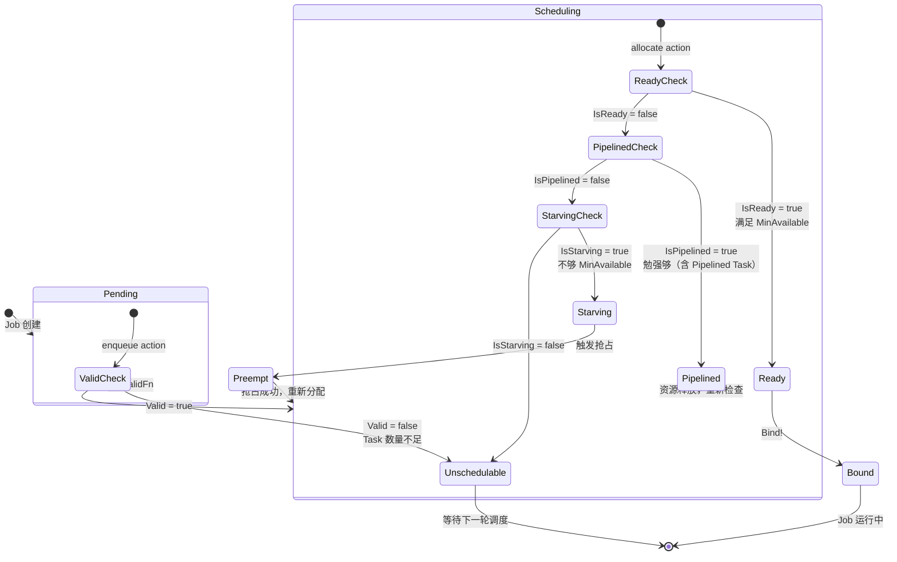

### 5.2 阈值对照

| Job 状态 | 公式 | 行为 |
|----------|------|------|
| Ready | `ready ≥ MinAvailable` | Bind → 运行 |
| Pipelined | `ready + pipelined ≥ MinAvailable` | 等待资源 |
| Starving | `ready + pipelined < MinAvailable` | 触发抢占 |
| Unschedulable | `valid < MinAvailable` | 不调度 |

---

## 6. 抢占与回收保护

### 6.1 核心算法

```mermaid
flowchart TD
    START([输入: preemptor, preemptees]) --> INIT[jobOccupiedMap = {}]
    INIT --> LOOP{遍历 preemptees}

    LOOP -->|next| GETJOB[获取 preemptee 的 Job]
    GETJOB --> CACHED{job 已在<br/>jobOccupiedMap?}

    CACHED -->|no| QUERY[jobOccupiedMap[job] =<br/>job.ReadyTaskNum]
    CACHED -->|yes| CHECK
    QUERY --> CHECK{jobOccupiedMap[job]<br/> > job.MinAvailable?}

    CHECK -->|yes| ALLOW[victims.append preemptee<br/>jobOccupiedMap[job]--]
    CHECK -->|no| SKIP[拒绝抢占<br/>保护 Gang 语义]

    ALLOW --> LOOP
    SKIP --> LOOP
    LOOP -->|done| RETURN([返回 victims])
```

### 6.2 数值示例

```
Job A: MinAvailable=3, ReadyTaskNum=5
  → 超额 2 个 Task → 最多可被抢 2 个 ✓

Job B: MinAvailable=3, ReadyTaskNum=3
  → 超额 0 个 Task → 一个都不能抢 ✗

Job C: MinAvailable=3, ReadyTaskNum=4
  → 超额 1 个 Task → 最多可被抢 1 个 ✓
```

### 6.3 为什么 Gang 保护至关重要

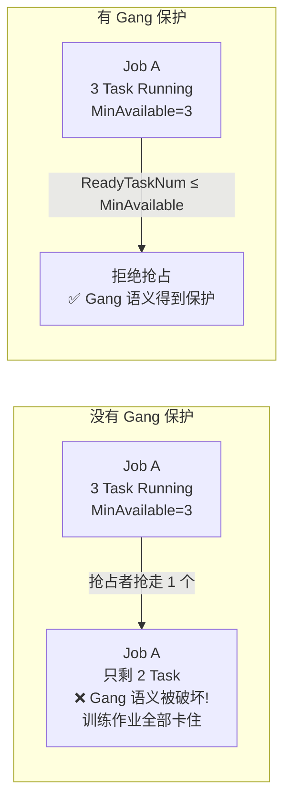

---

## 7. OnSessionClose 流程

### 7.1 完整流程

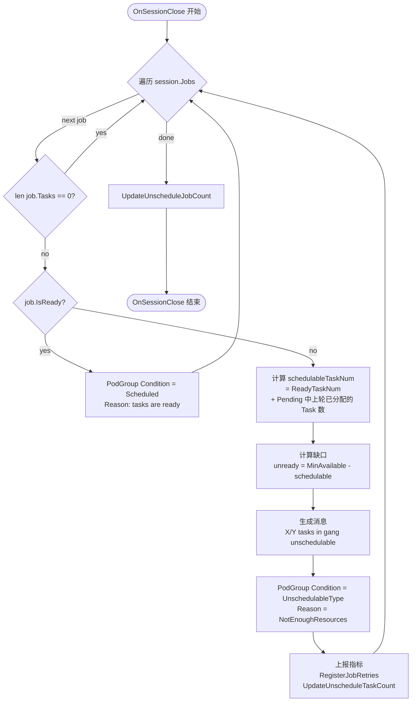

### 7.2 schedulableTaskNum 的双重计数

```go
schedulableTaskNum := func() (num int32) {
    for _, task := range job.TaskStatusIndex[api.Pending] {
        ctx := task.GetTransactionContext()
        if task.LastTransaction != nil {
            ctx = *task.LastTransaction   // 使用上一轮事务的上下文
        }
        if api.AllocatedStatus(ctx.Status) {
            num++   // 在上一轮中已分配 → 本轮仍然是"可调度"的
        }
    }
    return num + job.ReadyTaskNum()
}
```

**为什么要查 LastTransaction？**

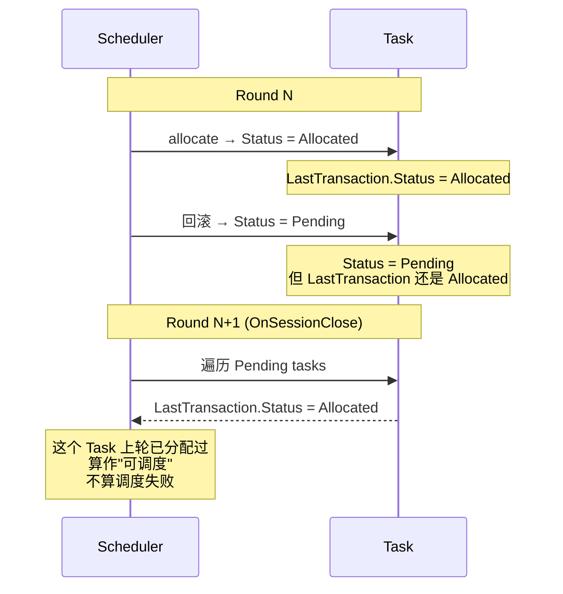

这避免了在 OnSessionClose 中把"曾经分配过但被回滚"的 Task 误算为"调度失败"。

---

## 8. 完整调度流程中的 Gang

### 8.1 一个调度周期中的 Gang 检查点

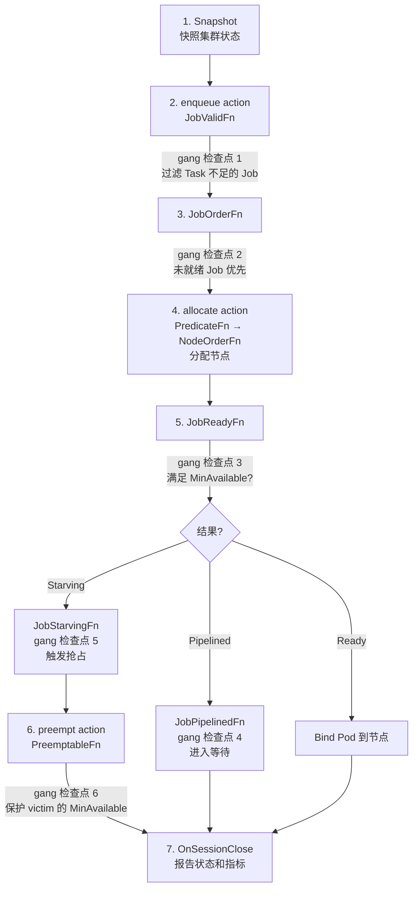

### 8.2 全部 6 个 Gang 检查点

| # | 检查点 | 函数 | 作用 |
|---|--------|------|------|
| 1 | enqueue | `JobValidFn` | 过滤 Pod 数量不足的 Job |
| 2 | order | `JobOrderFn` | 未就绪 Job 优先调度 |
| 3 | allocate | `JobReadyFn` | 判断是否可以 Bind |
| 4 | allocate | `JobPipelinedFn` | 判断是否可进入 Pipeline |
| 5 | allocate | `JobStarvingFn` | 判断是否需要抢占 |
| 6 | preempt | `PreemptableFn` | 保护 victim 的 MinAvailable |
| — | close | `OnSessionClose` | 报告最终状态 |

---

## 9. 与 binpack / nodeorder 的协作

### 9.1 三者职责对比

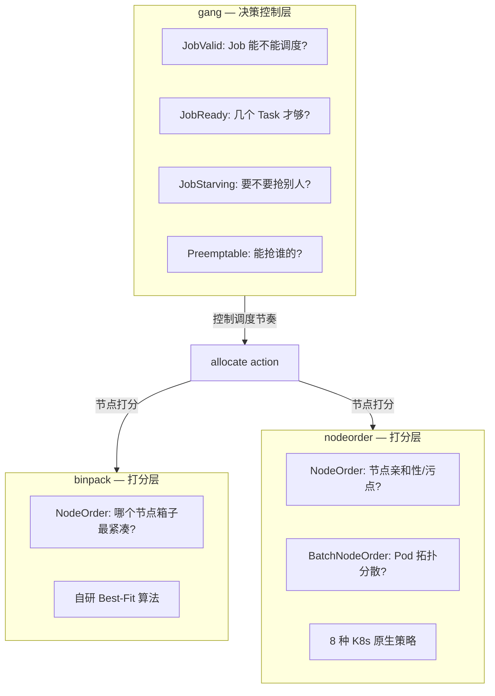

### 9.2 典型调度配置

```yaml
actions: "enqueue, allocate, backfill, preempt"
tiers:
- plugins:
  - name: gang           # ← 控制层：决定 Job 是否满足 Gang 条件
  - name: priority       # ← 排序层：按优先级排列 Job
- plugins:
  - name: predicates     # ← 过滤层：过滤不满足条件的节点
  - name: binpack        # ← 打分层：紧凑装箱
  - name: nodeorder      # ← 打分层：K8s 原生亲和性/拓扑等
```

### 9.3 协作时序

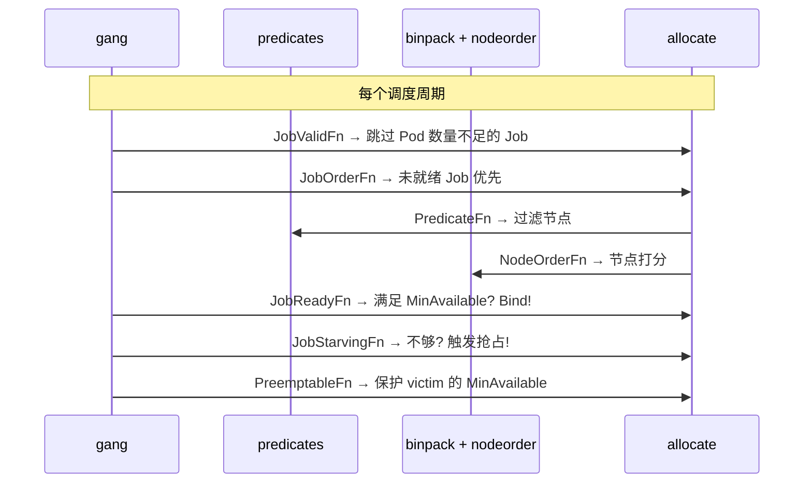

---

## 10. 总结

### 10.1 核心设计理念

| 理念 | 体现 |
|------|------|
| **All-or-Nothing** | MinAvailable 阈值控制整体就绪 |
| **三层约束** | TaskRole / SubJobGroup / Global |
| **饥饿优先** | 未就绪的 Job 获得更高调度优先级 |
| **超额保护** | 只抢占 victim 的超额 Task |
| **透支机制** | Pipelined 状态允许"信用消费" |

### 10.2 gang 与其他两个插件的本质区别

| | gang | binpack | nodeorder |
|------|------|------|------|
| **类型** | 决策控制 | 节点打分 | 节点打分 |
| **核心参数** | MinAvailable | binpack.weight | leastrequested.weight 等 |
| **自研 vs 复用** | 纯自研 | 纯自研 | K8s 原生适配 |
| **扩展点数量** | 10+ | 1 (NodeOrder) | 2 (NodeOrder + BatchNodeOrder) |
| **复杂度** | 高（状态机+抢占保护） | 低（公式打分） | 中（8 插件管理） |

### 10.3 适用场景

- ✅ 分布式训练（TensorFlow, PyTorch, MPI）
- ✅ 多副本服务（需要 N 个副本同时就绪）
- ✅ 批处理 Job（All-or-Nothing 语义）
- ⚠️ 单 Pod Job：gang 无额外价值（MinAvailable=1 时相当于普通调度）
- ⚠️ 无 Gang 语义的微服务：不需要 gang 插件

---

*文档生成日期：2026-06-20*
*基于 Volcano 源码分析*
