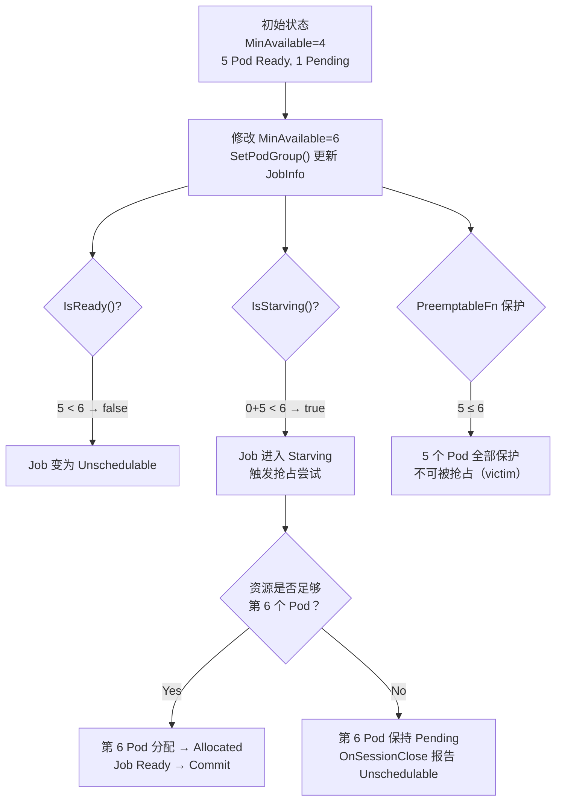
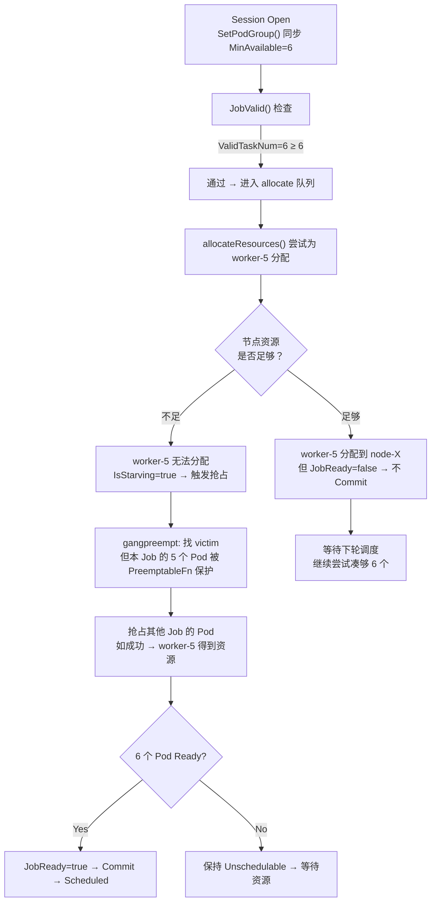

# Gang 调度 MinAvailable 动态修改行为分析

## 目录

1. [问题场景](#1-问题场景)
2. [核心结论](#2-核心结论)
3. [源码级分析](#3-源码级分析)
4. [完整流程推演](#4-完整流程推演)
5. [关键源码索引](#5-关键源码索引)
6. [设计要点](#6-设计要点)

---

## 1. 问题场景

```
初始状态：Job 配置 totalPods=6, MinAvailable=4
当前状态：5 个 Pod 已调度成功（Bound/Running），1 个 Pending
操作：    将 MinAvailable 从 4 改为 6

问题：    已调度的 5 个 Pod 会被驱逐吗？
```

## 2. 核心结论

**已调度的 Pod 不会被驱逐。** 原因：

| 机制 | 行为 | 源码 |
|------|------|------|
| `PreemptableFn` 保护 | `ReadyTaskNum(5) ≤ MinAvailable(6)` → 5 个 Pod 全部受保护，不可被抢占 | [gang.go:200](gang.go#L200) |
| 无 Undo/Bind 机制 | Volcano 调度器只控制 Bind，不控制 Unbind/Evict | [allocate.go:376](allocate.go#L376) |
| Job 状态变更 | `IsReady()` → false, `IsStarving()` → true | [job_info.go:1202](job_info.go#L1202) |
| 剩余 Pod 处理 | 调度器尝试分配第 6 个 Pod，若资源不足触发抢占 | [allocate.go:345](allocate.go#L345) |

### 状态流转图



## 3. 源码级分析

### 3.1 MinAvailable 如何被更新

[SetPodGroup()](job_info.go#L453) 每次调度会话开始时从 PodGroup 同步 MinMember：

```go
// job_info.go:456
ji.MinAvailable = pg.Spec.MinMember
```

当用户修改 PodGroup.Spec.MinMember 从 4 变为 6，下一次 `SetPodGroup` 调用时 `ji.MinAvailable` 就会更新为 6。

### 3.2 PreemptableFn：为什么不会驱逐已调度 Pod

[PreemptableFn](gang.go#L180-L212) 的核心保护逻辑：

```         ┌─────────────────────────────────────┐
         │ jobOccupiedMap[job.UID] = 5       │
         │ job.MinAvailable = 6               │
         │ 5 > 6 ? → false → 保护！           │
         └─────────────────────────────────────┘
```

**关键判断**（[gang.go:200](gang.go#L200)）：

```go
if jobOccupiedMap[job.UID] > job.MinAvailable {
    jobOccupiedMap[job.UID]--
    victims = append(victims, preemptee)
} else {
    // 5 不大于 6 → 拒绝抢占，保护 Gang 语义
}
```

**结论**：`ReadyTaskNum(5) ≤ MinAvailable(6)`，该 Job 的所有 5 个 Ready Pod 都不在 `victims` 列表中，其他 Job 无法抢占它们。

### 3.3 IsReady / IsPipelined / IsStarving 状态判定

[IsReady()](job_info.go#L1202) 在 MinAvailable 上调后面临的新判定：

```go
// job_info.go:1202-1204
func (ji *JobInfo) IsReady() bool {
    return ji.ReadyTaskNum() + ji.PendingBestEffortTaskNum() >= ji.MinAvailable
    //     5               + 0                            >= 6  →  false
}
```

[IsStarving()](job_info.go#L1210-L1212)：

```go
// job_info.go:1210-1212
func (ji *JobInfo) IsStarving() bool {
    return ji.WaitingTaskNum() + ji.ReadyTaskNum() < ji.MinAvailable
    //     0                  + 5                < 6  →  true（饥饿！）
}
```

[IsPipelined()](job_info.go#L1206-L1208)：

```go
// job_info.go:1206-1208
func (ji *JobInfo) IsPipelined() bool {
    return ji.WaitingTaskNum() + ji.ReadyTaskNum() + ji.PendingBestEffortTaskNum() >= ji.MinAvailable
    //     0                  + 5                + 0                              >= 6  →  false
}
```

**状态矩阵**：

| 状态 | 公式 | 计算 | 结果 |
|------|------|------|------|
| `IsReady()` | `ReadyTaskNum + PendingBestEffort ≥ MinAvailable` | `5 + 0 ≥ 6` | **false** |
| `IsPipelined()` | `WaitingTaskNum + ReadyTaskNum + PendingBestEffort ≥ MinAvailable` | `0 + 5 + 0 ≥ 6` | **false** |
| `IsStarving()` | `WaitingTaskNum + ReadyTaskNum < MinAvailable` | `0 + 5 < 6` | **true** |

### 3.4 allocate Action 的行为

[allocate.go:376-377](allocate.go#L376) 和 [allocate.go:392-393](allocate.go#L392)：

```go
if stmt != nil && ssn.JobReady(job) {  // JobReady 为 false → 不执行
    stmt.Commit()
}
```

由于 `JobReady()` 返回 false（IsReady = false），即使分配了第 6 个 Pod，stmt 也不会被 Commit。

### 3.5 OnSessionClose 的报告

[gang.go:390-439](gang.go#L390)：

```go
if !job.IsReady() {
    schedulableTaskNum := ... // 已 Ready 的 Task + 从上次事务回滚的 Task
    unreadyTaskCount = job.MinAvailable - schedulableTaskNum()
    // unreadyTaskCount = 6 - 5 = 1
    msg := fmt.Sprintf("%v/%v tasks in gang unschedulable: %v",
        unreadyTaskCount, len(job.Tasks), job.FitError())
    // "1/6 tasks in gang unschedulable: ..."
}
```

### 3.6 ValidTaskNum 与 JobValid 检查

[ValidTaskNum()](job_info.go#L1130-L1142) 统计所有可用 Task：

```go
func (ji *JobInfo) ValidTaskNum() int32 {
    occupied := 0
    for status, tasks := range ji.TaskStatusIndex {
        if AllocatedStatus(status) ||  // Bound/Binding/Running/Allocated
            status == Succeeded ||
            status == Pipelined ||
            status == Pending {         // 包含 Pending！
            occupied += len(tasks)
        }
    }
    return int32(occupied)
}
```

**计算结果**：`5（已调度） + 1（Pending）= 6 ≥ MinAvailable(6)` → JobValid 通过。

这意味着调度器**允许**对该 Job 进行调度尝试（不会在调度周期开始时跳过）。

## 4. 完整流程推演

### 场景具体化

```
Job: tf-training
├── 总 Pod 数: 6
├── Pod 角色: worker
├── 初始 MinAvailable: 4
├── 当前状态:
│   ├── worker-0: Running (node-1)
│   ├── worker-1: Running (node-2)
│   ├── worker-2: Running (node-3)
│   ├── worker-3: Running (node-1)
│   ├── worker-4: Running (node-2)
│   └── worker-5: Pending
└── 操作: 修改 PodGroup.Spec.MinMember 4 → 6
```

### T0: MinAvailable 变更前

```
IsReady()     → 5 ≥ 4 → true  → Job 就绪
IsStarving()  → 0 + 5 < 4 → false → 不饥饿
OnSessionClose → PodGroup Condition = Scheduled
```

### T1: MinAvailable 变更后（下一次调度周期）



### T2: OnSessionClose

```go
job.IsReady()          → false
unreadyTaskCount       → 1
PodGroup Condition     → UnschedulableType
Message                → "1/6 tasks in gang unschedulable: ..."
```

**关键点**：已 Running 的 5 个 Pod 继续运行，不受任何影响。只有 worker-5 处于 Pending 状态等待资源。

## 5. 关键源码索引

| 文件 | 行号 | 关键函数/逻辑 |
|------|------|---------------|
| [gang.go](gang.go) | L120-L161 | `validJobFn`: JobValid — 检查 ValidTaskNum ≥ MinAvailable |
| [gang.go](gang.go) | L180-L223 | `preemptableFn`: 抢占保护 — ReadyTaskNum > MinAvailable 才允许抢 |
| [gang.go](gang.go) | L295-L315 | `jobReadyFn`: 就绪判定 — ReadyTaskNum + BestEffort ≥ MinAvailable |
| [gang.go](gang.go) | L325-L341 | `pipelinedFn`: Pipeline 判定 — Waiting + Ready + BestEffort ≥ MinAvailable |
| [gang.go](gang.go) | L354-L369 | `jobStarvingFn`: 饥饿判定 — Waiting + Ready < MinAvailable |
| [gang.go](gang.go) | L388-L474 | `OnSessionClose`: 报告未就绪 Job 的状态 |
| [job_info.go](job_info.go) | L453-L501 | `SetPodGroup`: 从 PodGroup 同步 MinAvailable |
| [job_info.go](job_info.go) | L877-L886 | `ReadyTaskNum`: 统计 Bound/Binding/Running/Allocated/Succeeded |
| [job_info.go](job_info.go) | L889-L891 | `WaitingTaskNum`: 统计 Pipelined |
| [job_info.go](job_info.go) | L1130-L1142 | `ValidTaskNum`: 统计所有可用 Task（含 Pending） |
| [job_info.go](job_info.go) | L1202-L1212 | `IsReady` / `IsPipelined` / `IsStarving` |
| [allocate.go](allocate.go) | L376-L393 | Commit 条件：只有 JobReady 才执行 |
| [allocate.go](allocate.go) | L213-L216 | JobValid 检查：不通过则跳过该 Job |

## 6. 设计要点

### 6.1 为什么已调度 Pod 不被驱逐？

1. **调度器职责边界**：Volcano 调度器负责"何时将 Pod 绑定到哪个节点"（Bind），而不负责"何时将已运行的 Pod 收回"（Evict）。Pod 一旦 Bound，生命周期由 Kubelet 接管。

2. **Gang 保护语义的唯一方向**：Gang 的 All-or-Nothing 语义是在"分配时"保证的——凑不够 MinAvailable 就不分配。它不保证已分配的 Pod 在 MinAvailable 变化后仍然满足条件。这是一种"前向保护"而非"后向修复"。

3. **PreemptableFn 的双重作用**：不仅防止本 Job 的 Pod 被其他 Job 抢占，也防止 MinAvailable 上调后本 Job 的 Pod 因"不再是超额部分"而被误抢。

### 6.2 MinAvailable 下调的影响（对比）

如果 MinAvailable 从 4 改为 3（下调）：

```
IsReady()   → 5 ≥ 3 → true（仍然就绪）
JobValid()  → 6 ≥ 3 → true（通过）
```

这种情况下没有任何负面影响，Job 保持 Healthy，第 6 个 Pod 也会正常调度（因为 Job 有 5 个 Ready，满足 MinAvailable=3）。

### 6.3 生产建议

- **上调 MinAvailable**：不会导致已运行 Pod 被驱逐，但可能导致 Job 变为 Starving，需要确认集群有足够资源抢占
- **下调 MinAvailable**：安全操作，无影响
- **建议配合 HPA 或 Job Controller**：如果要动态调整 MinAvailable，建议在 Job 创建时就设置合理的初始值，避免频繁修改
