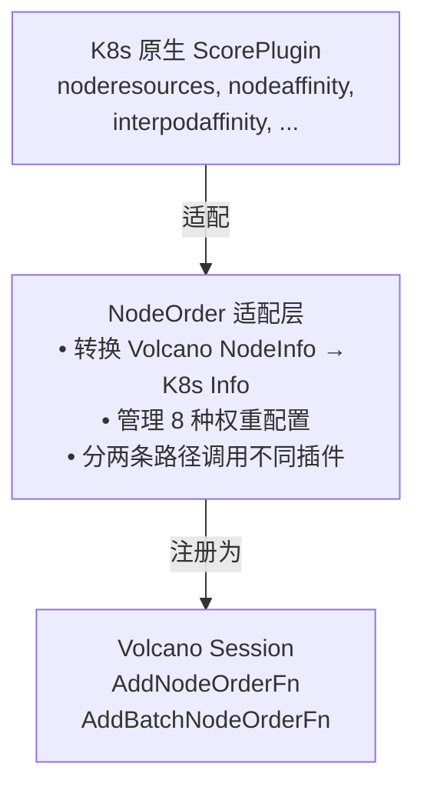
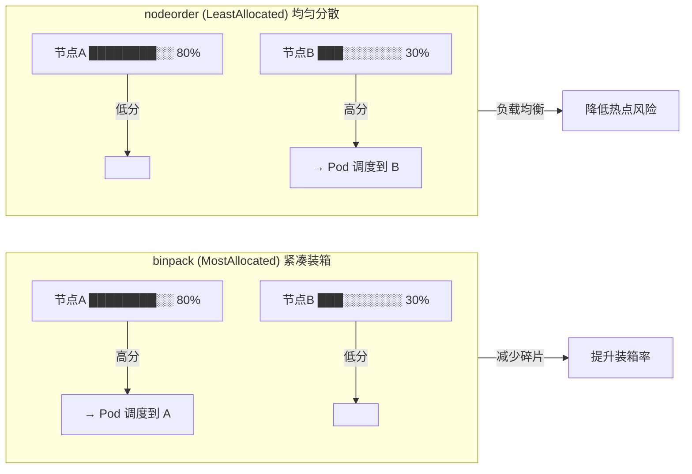
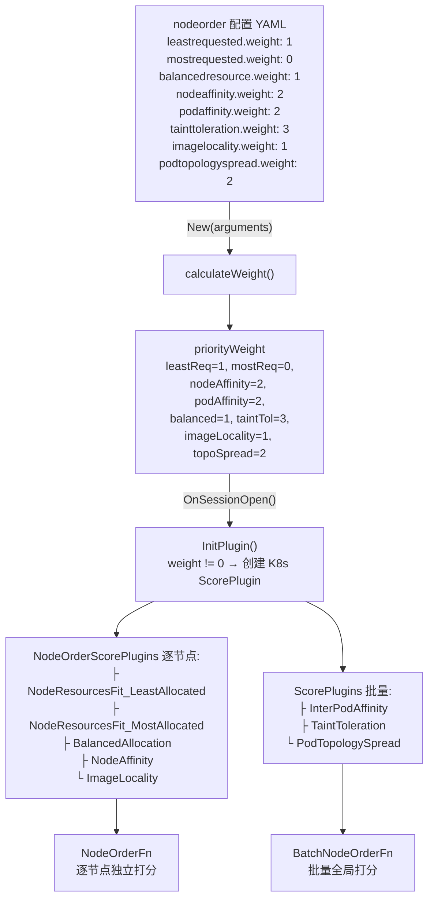
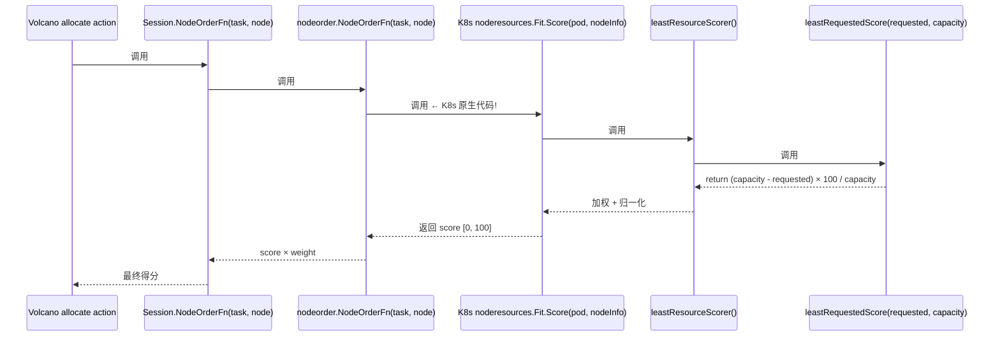
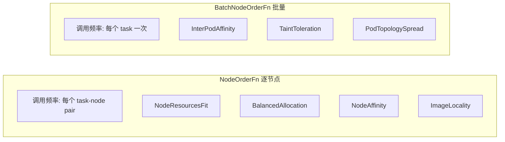
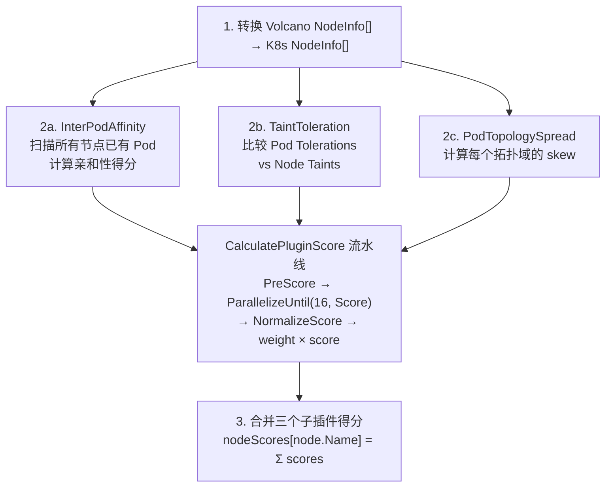
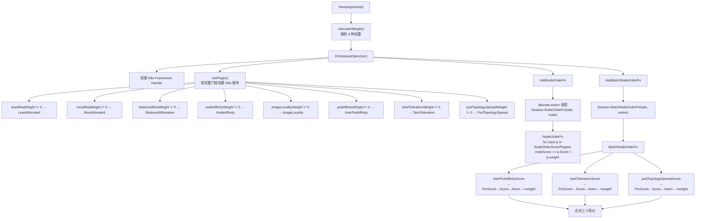
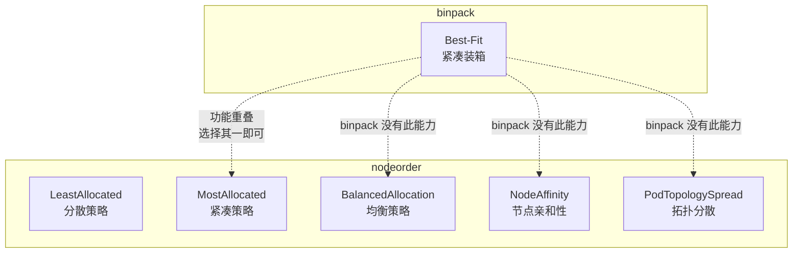

# Volcano NodeOrder 插件深度分析

## 目录

1. [概述](#1-概述)
2. [与 binpack 的关键对比](#2-与-binpack-的关键对比)
3. [架构设计](#3-架构设计)
4. [八大子策略详解](#4-八大子策略详解)
5. [两条打分路径](#5-两条打分路径)
6. [代码结构剖析](#6-代码结构剖析)
7. [配置体系](#7-配置体系)
8. [测试用例分析](#8-测试用例分析)
9. [设计要点](#9-设计要点)
10. [总结](#10-总结)

---

## 1. 概述

### 1.1 什么是 NodeOrder

NodeOrder 是 Volcano 调度器的**综合性节点优先级打分插件**。与 binpack 自研算法不同，NodeOrder 的核心设计理念是**复用 Kubernetes 原生调度插件的打分能力**，将它们包装成 Volcano 框架可用的 NodeOrder 插件。

### 1.2 设计动机

Volcano 作为批处理调度器，需要在节点打分方面与 K8s 默认调度器保持行为一致性（如节点亲和性、污点容忍、拓扑分散等）。与其重新实现这些逻辑，NodeOrder 选择充当"适配层"：



### 1.3 核心文件

| 文件 | 行数 | 功能 |
|------|------|------|
| `nodeorder.go` | 421 | 插件核心实现 |
| `nodeorder_test.go` | 436 | 端到端集成测试 + InitPlugin 逻辑测试 |
| `util/nodescore/score_helper.go` | 110 | 批量打分的通用流水线 |
| `util/k8s/framework.go` | 254 | K8s Framework Handle 适配层 |

---

## 2. 与 binpack 的关键对比

| 维度 | **binpack** | **nodeorder** |
|------|------------|---------------|
| **架构** | 纯 Volcano 自研算法 | K8s 原生插件适配层 |
| **打分公式** | 自研公式：`(used+req)/cap × weight` | 复用 K8s 原生插件公式 |
| **资源支持** | 运行时配置任意扩展资源 | 通过 `NodeResourcesFitArgs` 静态声明 |
| **归一化** | 手动加权求和后归一化 | 每个子插件自行归一化 |
| **扩展性** | 新增资源只需 YAML 配置 | 新增策略需要代码变更 |
| **批量打分** | ❌ 不支持 | ✅ BatchNodeOrderFn |
| **紧凑策略** | 唯一的策略 | MostAllocated（可选，默认关闭） |
| **分散策略** | ❌ 不支持 | LeastAllocated（默认开启） |
| **均衡策略** | ❌ 不支持 | BalancedAllocation |
| **亲和性** | ❌ 不支持 | NodeAffinity + InterPodAffinity |
| **拓扑分散** | ❌ 不支持 | PodTopologySpread |

### 2.1 策略语义对照



---

## 3. 架构设计

### 3.1 组件关系图



### 3.2 数据结构

#### NodeOrderPlugin

```go
type NodeOrderPlugin struct {
    pluginArguments       framework.Arguments
    weight                priorityWeight
    Handle                fwk.Handle                              // K8s 框架句柄
    ScorePlugins          map[string]nodescore.BaseScorePlugin     // 批量插件
    NodeOrderScorePlugins map[string]ScorePluginWithWeight         // 逐节点插件
}
```

#### ScorePluginWithWeight

```go
type ScorePluginWithWeight struct {
    plugin fwk.ScorePlugin  // K8s 原生插件实例
    weight int              // Volcano 侧配置的权重
}
```

设计要点：`ScorePluginWithWeight` 将 K8s 原生的 `ScorePlugin` 与 Volcano 侧的 `weight` 绑定。K8s 原生插件的 Score 范围是 `[0, 100]`，乘以 weight 后得到该子策略的贡献值。

---

## 4. 八大子策略详解

### 4.1 资源分配策略（三种）

#### a) LeastAllocated — 分散策略（默认开启）

**K8s 原生源码**（`k8s.io/kubernetes/pkg/scheduler/framework/plugins/noderesources/least_allocated.go:52-61`）：

```go
// The unused capacity is calculated on a scale of 0-MaxNodeScore
// 0 being the lowest priority and `MaxNodeScore` being the highest.
// The more unused resources the higher the score is.
func leastRequestedScore(requested, capacity int64) int64 {
    if capacity == 0 {
        return 0
    }
    if requested > capacity {
        return 0
    }
    return ((capacity - requested) * framework.MaxNodeScore) / capacity
}
```

**等效公式**：

```
score = (capacity - requested) × MaxNodeScore / capacity
     = 空闲率 × 100
```

- **语义**：节点**空闲资源越多**，得分越高
- **效果**：将 Pod 均匀分散到所有节点
- **与 binpack 的关系**：**完全相反！** binpack 选择最满的节点，LeastAllocated 选择最空的节点
- **适用**：高可用场景、在线服务负载均衡

#### b) MostAllocated — 紧凑策略（默认关闭）

**K8s 原生源码**（`k8s.io/kubernetes/pkg/scheduler/framework/plugins/noderesources/most_allocated.go:54-65`）：

```go
// The used capacity is calculated on a scale of 0-MaxNodeScore (MaxNodeScore is
// constant with value set to 100).
// 0 being the lowest priority and 100 being the highest.
// The more resources are used the higher the score is. This function
// is almost a reversed version of noderesources.leastRequestedScore.
func mostRequestedScore(requested, capacity int64) int64 {
    if capacity == 0 {
        return 0
    }
    if requested > capacity {
        // `requested` might be greater than `capacity` because pods with no
        // requests get minimum values.
        requested = capacity
    }
    return (requested * framework.MaxNodeScore) / capacity
}
```

**等效公式**：

```
score = requested × MaxNodeScore / capacity
     = 利用率 × 100
```

- **语义**：节点**已用资源越多**，得分越高
- **效果**：将 Pod 塞到最满的节点上
- **与 binpack 的关系**：**策略相同！** 但实现路径不同（K8s 原生 vs Volcano 自研）
- **适用**：批处理工作负载、资源利用率优化

#### c) LeastAllocated 与 MostAllocated 的多维度加权

两者共用同一套加权框架（`least_allocated.go:30-46` 和 `most_allocated.go:30-46`）：

```go
// leastResourceScorer 的多维度加权（mostResourceScorer 结构完全相同）
func leastResourceScorer(resources []config.ResourceSpec) func([]int64, []int64) int64 {
    return func(requested, allocable []int64) int64 {
        var nodeScore, weightSum int64
        for i := range requested {
            if allocable[i] == 0 {
                continue
            }
            weight := resources[i].Weight
            resourceScore := leastRequestedScore(requested[i], allocable[i])
            nodeScore += resourceScore * weight
            weightSum += weight
        }
        if weightSum == 0 {
            return 0
        }
        return nodeScore / weightSum   // ← 归一化
    }
}
```

**这与 binpack 的 `BinPackingScore` 结构惊人地相似**——都是遍历资源维度 → 加权 → 归一化。区别仅在于单维度公式是 `capacity - requested` 还是 `used + requested`。

#### d) 数值示例：同一个 Pod，同一个节点，两种策略

```
节点: 2 CPU 总量, 已用 1 CPU
Pod:  需要 1 CPU
```

**binpack（紧凑）：**
```
score = (1 + 1) / 2 × weight = 1.0 × weight  → 高分！
→ 节点被填满，紧凑装箱喜欢这个
```

**K8s LeastAllocated（分散）：**
```
score = (2 - 1) / 2 × 100 = 0.5 × 100 = 50   → 中等分
→ 节点空闲率为 0.5，分散策略不太满意
```

**换一个空闲节点（总量 4 CPU，已用 0 CPU）：**

| 策略 | 计算 | 得分 |
|------|------|------|
| binpack | `(0+1)/4 × weight` | 0.25 × weight ↓ |
| LeastAllocated | `(4-1)/4 × 100` | 75 ↑ |

**结论**：binpack 给"满节点"高分，LeastAllocated 给"空节点"高分——两者对同一个节点的打分完全相反。

#### e) nodeorder 如何"复用"K8s 的分散策略

nodeorder 没有任何自研的分散算法。它做的事情就是：

```go
// nodeorder.go InitPlugin() 中
// 1. 声明配置：使用 K8s 的 LeastAllocated 策略
leastAllocatedArgs := &config.NodeResourcesFitArgs{
    ScoringStrategy: &config.ScoringStrategy{
        Type:      config.LeastAllocated,   // ← 就这一个枚举值决定是"分散"
        Resources: []config.ResourceSpec{
            {Name: "cpu", Weight: 50},
            {Name: "memory", Weight: 50},
        },
    },
}

// 2. 调用 K8s 原生的 NewFit 构造函数，拿到 K8s 插件实例
p, err := noderesources.NewFit(context.TODO(), leastAllocatedArgs, pp.Handle, fts)
leastAllocated := p.(*noderesources.Fit)

// 3. 存起来，打分时直接调用 K8s 的 Score() 方法
nodeOrderScorePlugins[...] = ScorePluginWithWeight{leastAllocated, pp.weight.leastReqWeight}
```

**完整委托链路**：



**一句话总结**：nodeorder 的"分散"就是 K8s 默认调度器的"分散"，没有一行自研代码。K8s 默认就是 LeastAllocated，nodeorder 只是把它从 K8s 的 `ScorePlugin` 接口适配到了 Volcano 的 `NodeOrderFn` 接口。

#### c) BalancedAllocation — 均衡策略

```
score = (1 - |cpuUtil - memUtil|) × weight
```

- **语义**：CPU 和内存使用率差距越小的节点得分越高
- **效果**：避免出现"CPU 用满但内存大量空闲"的不均衡状态
- **适用**：CPU 和内存配比均衡的工作负载

### 4.2 亲和性/反亲和性策略（三种）

#### d) NodeAffinity — 节点亲和性

- 根据 Pod 的 `PreferredDuringSchedulingIgnoredDuringExecution` 规则打分
- 匹配 Pod 声明的节点标签偏好
- 例如：偏好 `zone=zone1` 的节点

#### e) InterPodAffinity — Pod 间亲和性

- 根据 Pod 的 `PodAffinity`/`PodAntiAffinity` 规则打分
- 需要全局扫描所有节点上已运行的 Pod（因此走批量路径）
- 例如：将 Web Pod 与 Cache Pod 放在同一节点

#### f) TaintToleration — 污点容忍

- 根据 Pod 的 `Tolerations` 与节点的 `Taints` 匹配度打分
- Pod 能容忍的污点越多，得分越高
- 需要比较多个候选节点的污点差异（因此走批量路径）

### 4.3 其他策略（两种）

#### g) ImageLocality — 镜像本地性

- 节点上已有 Pod 所需镜像时得分更高
- 减少镜像拉取时间，加速 Pod 启动

#### h) PodTopologySpread — Pod 拓扑分散

- 基于 `TopologySpreadConstraint` 最小化跨拓扑域（zone, hostname 等）的 skew
- 需要全局扫描所有拓扑域的 Pod 分布（因此走批量路径）
- 例如：确保 app=foo 的 Pod 在各 zone 均匀分布

---

## 5. 两条打分路径

### 5.1 设计原因



**为什么需要分离？**

1. **性能** — NodeOrderFn 在 `O(T×N)` 的循环中被频繁调用（T=任务数，N=候选节点数）。如果每次都执行 InterPodAffinity 的全局扫描，开销巨大。

2. **正确性** — InterPodAffinity 和 PodTopologySpread 需要 PreScore 阶段来预处理全局信息。如果在逐节点路径中调用，每个 node 的 PreScore 会重复执行。

3. **K8s 兼容** — K8s 原生也区分 PreScore/Score/NormalizeScore 阶段，batch 路径复用了这个标准流水线。

### 5.2 NodeOrderFn 流程

```go
for each plugin in NodeOrderScorePlugins:
    score = plugin.Score(pod, k8sNodeInfo)   // K8s 原生 [0, 100]
    nodeScore += score × plugin.weight        // 加权累加
return nodeScore
```

### 5.3 BatchNodeOrderFn 流程



---

## 6. 代码结构剖析

### 6.1 完整调用链路



### 6.2 关键函数职责

| 函数 | 职责 |
|------|------|
| `New()` | 工厂函数，解析权重 |
| `calculateWeight()` | 解析 8 种权重参数，设置默认值 |
| `OnSessionOpen()` | 创建 K8s Handle，初始化插件，注册两条打分函数 |
| `InitPlugin()` | 按权重门控创建 K8s 原生 ScorePlugin 实例 |
| `NodeOrderFn()` | 单节点打分（5 个逐节点插件） |
| `BatchNodeOrderFn()` | 批量打分（3 个批量插件） |
| `interPodAffinityScore()` | InterPodAffinity 批量打分流水线 |
| `taintTolerationScore()` | TaintToleration 批量打分流水线 |
| `podTopologySpreadScore()` | PodTopologySpread 批量打分流水线 |

---

## 7. 配置体系

### 7.1 完整配置示例

```yaml
actions: "enqueue, reclaim, allocate, backfill, preempt"
tiers:
- plugins:
  - name: nodeorder
    arguments:
      # ===== 资源分配策略 =====
      leastrequested.weight: 1        # 分散策略（默认开启）
      mostrequested.weight: 0         # 紧凑策略（默认关闭，与 binpack 冲突时关闭）
      balancedresource.weight: 1      # 均衡策略

      # ===== 亲和性策略 =====
      nodeaffinity.weight: 2          # 节点亲和性偏好
      podaffinity.weight: 2           # Pod 间亲和性

      # ===== 容忍与分散 =====
      tainttoleration.weight: 3       # 污点容忍（权重最高）
      podtopologyspread.weight: 2     # Pod 拓扑分散

      # ===== 优化 =====
      imagelocality.weight: 1         # 镜像本地性
```

### 7.2 与 binpack 共存的推荐配置

```yaml
tiers:
- plugins:
  - name: binpack
    arguments:
      binpack.weight: 5               # binpack 中低权重
      binpack.cpu: 1
      binpack.memory: 1

  - name: nodeorder
    arguments:
      mostrequested.weight: 0         # 关闭 nodeorder 的紧凑策略
      leastrequested.weight: 1        # 保留分散策略
      balancedresource.weight: 1
      nodeaffinity.weight: 2
      # ... 其他策略正常配置
```

> **注意**：如果同时启用 `binpack` 和 `nodeorder.mostrequested`，两者都会对紧凑装箱产生正向得分，可能导致装箱策略过强，挤压其他策略（如均衡、亲和性）的影响力。

### 7.3 权重调优建议

| 场景 | LeastReq | MostReq | Balanced | 说明 |
|------|----------|---------|----------|------|
| 默认批处理 | 1 | 0 | 1 | K8s 兼容模式 |
| 激进装箱 | 0 | 5 | 0 | 配合/替代 binpack |
| 在线服务 | 5 | 0 | 1 | 均匀分散负载 |
| GPU 集群 | 1 | 0 | 2 | 均衡 CPU/Mem/GPU |
| 混合工作负载 | 2 | 2 | 1 | 平衡装箱与分散 |

---

## 8. 测试用例分析

### 8.1 TestNodeOrderPlugin — 7 个端到端集成测试

| # | 测试名 | 验证策略 | 核心断言 |
|---|--------|----------|----------|
| 1 | leastAllocated | 分散 | n1(2c/4G) vs n2(4c/8G)，Pod(1c/1G) → n2 |
| 2 | mostAllocated | 紧凑 | 同场景 → n1（利用率更高） |
| 3 | balanced | 均衡 | n1(2c/2G 均衡) vs n2(4c/2G 不均衡) → n1 |
| 4 | nodeAffinity | 亲和性 | n1(zone=zone1) 匹配 Pod 偏好 → n1 |
| 5 | taintToleration | 污点 | n1(无污点) vs n2(有污点) → n1 |
| 6 | interPodAffinity | Pod亲和 | p1 在 n1，p2 亲和 p1 → p2 调 n1 |
| 7 | podTopologySpread | 拓扑分散 | zone1:2, zone2:1, zone3:0 → 调 zone3 |

**测试设计特点：**

- 每条测试只启用一个高权重策略，确保打分决策由目标策略主导
- 使用 `ExpectBindMap` 精确验证最终绑定节点（端到端验证）
- 通过 `allocate` action 真实调用 `NodeOrderFn` → `BatchNodeOrderFn` 链路

### 8.2 TestInitPlugin — 插件创建逻辑验证

| 场景 | 验证点 |
|------|--------|
| 默认权重 | LeastAllocated 创建、MostAllocated 不创建、批量插件均创建 |
| 全零权重 | 所有子插件都不创建 |

---

## 9. 设计要点

### 9.1 权重门控模式

```go
if pp.weight.leastReqWeight != 0 {
    // 创建 LeastAllocated 插件
}
```

每个子插件只在 `weight != 0` 时才实例化。这带来两个好处：
- **性能**：不需要的插件不会消耗内存和初始化时间
- **语义清晰**：`weight == 0` 明确表示"不使用该策略"

### 9.2 两类插件的技术区别

**NodeOrderScorePlugins（逐节点）：**
- 实现 `fwk.ScorePlugin` 接口
- 可以独立对每个节点打分
- 不需要 PreScore 预处理

**ScorePlugins（批量）：**
- 实现 `nodescore.BaseScorePlugin`（`fwk.PreScorePlugin + fwk.ScorePlugin`）
- 需要 PreScore 阶段扫描全局信息
- Score 需要访问 PreScore 的结果

### 9.3 防御性编程

```go
if pp.ScorePlugins[interpodaffinity.Name] != nil {
    podAffinityScores, err = interPodAffinityScore(...)
}
```

批量路径中的每个子插件都用 `nil` 检查守卫，确保即使用户将某个子插件权重设为 0，代码也不会 panic。

### 9.4 K8s 兼容性

```go
fts := feature.Features{
    EnableNodeInclusionPolicyInPodTopologySpread: utilFeature.DefaultFeatureGate.Enabled(...),
    EnableMatchLabelKeysInPodTopologySpread:      utilFeature.DefaultFeatureGate.Enabled(...),
}
```

NodeOrder 在初始化时读取 K8s FeatureGate 状态，传递给 K8s 原生插件。这确保了 Volcano 中的 K8s 原生插件行为与 K8s 默认调度器保持一致。

---

## 10. 总结

### 10.1 核心设计理念

| 理念 | 体现 |
|------|------|
| **适配而非重写** | 复用 K8s 原生 8 种 ScorePlugin |
| **按需加载** | weight==0 不创建插件实例 |
| **职责分离** | 逐节点 vs 批量两条打分路径 |
| **向后兼容** | 默认权重与 K8s 默认行为一致 |

### 10.2 与 binpack 的协作建议



**推荐组合**：
- `binpack` 负责紧凑装箱（自研算法，扩展性更好）
- `nodeorder` 负责亲和性、污点、拓扑分散、镜像本地性（复用 K8s 能力）
- 关闭 `nodeorder.mostrequested` 避免与 binpack 重叠

### 10.3 适用场景

- ✅ 需要 K8s 默认调度行为的批处理集群
- ✅ 混合工作负载（部分需要分散、部分需要紧凑）
- ✅ 需要使用 Pod 拓扑分散约束的场景
- ✅ 需要精细控制多种节点优先级策略的场景
- ⚠️ 纯装箱优化场景：binpack 更简洁、扩展性更好

---

*文档生成日期：2026-06-20*
*基于 Volcano 源码分析*
