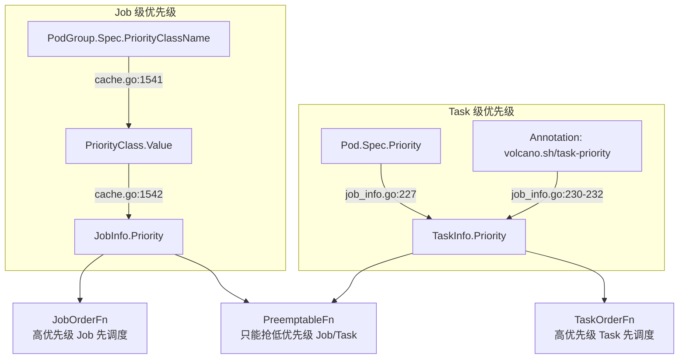
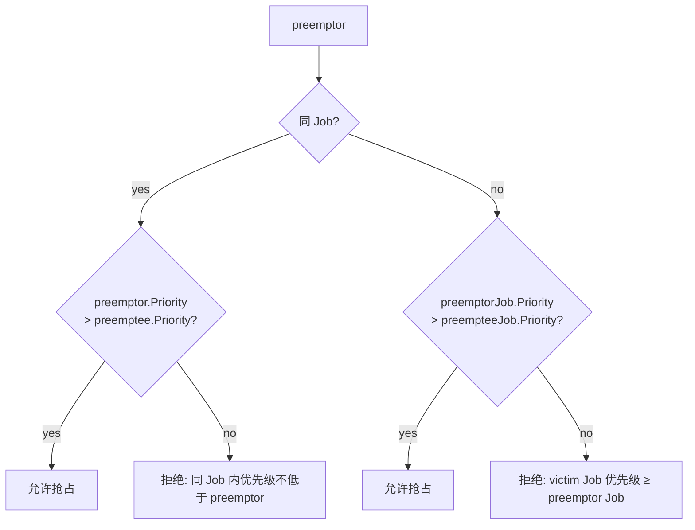

# Volcano 优先级体系分析

## 目录

1. [概述](#1-概述)
2. [两层优先级的来源](#2-两层优先级的来源)
3. [调度顺序影响](#3-调度顺序影响)
4. [抢占保护](#4-抢占保护)
5. [配置体系](#5-配置体系)
6. [总结](#6-总结)

---

## 1. 概述

Volcano 有两层独立的优先级体系，由 `priority` 插件统一管理：



| 层级 | 字段 | 来源 | 生效位置 |
|------|------|------|---------|
| Job | `JobInfo.Priority` | PodGroup → PriorityClass | `JobOrderFn`, `PreemptableFn` |
| Task | `TaskInfo.Priority` | Pod.Spec.Priority / annotation | `TaskOrderFn`, `PreemptableFn` |
| SubJob | `SubJobInfo.Priority` | 取子 Job 中最高 Priority Task | `SubJobOrderFn` |

### 核心文件

| 文件 | 功能 |
|------|------|
| `plugins/priority/priority.go` | 优先级插件实现 |
| `api/job_info.go:226-233` | TaskInfo.Priority 的赋值 |
| `cache/cache.go:1538-1546` | JobInfo.Priority 从 PriorityClass 解析 |

---

## 2. 两层优先级的来源

### 2.1 Job Priority — 来自 PodGroup 的 PriorityClassName

[`cache.go:1538-1546`](pkg/scheduler/cache/cache.go#L1538) — 调度器缓存加载 Job 时，将 PodGroup 的 `PriorityClassName` 解析为数值：

```go
value.Priority = sc.defaultPriority                          // 默认值
priName := value.PodGroup.Spec.PriorityClassName
if priorityClass, found := sc.PriorityClasses[priName]; found {
    value.Priority = priorityClass.Value                     // 从 PriorityClass 解析
}
```

用户配置：

```yaml
# PodGroup
apiVersion: scheduling.volcano.sh/v1beta1
kind: PodGroup
spec:
  priorityClassName: high-priority    # ← 指向一个 PriorityClass
  minMember: 3
---
# PriorityClass
apiVersion: scheduling.k8s.io/v1
kind: PriorityClass
metadata:
  name: high-priority
value: 1000                            # ← 数值越大优先级越高
```

### 2.2 Task Priority — 来自 Pod 的两种途径

[`job_info.go:226-233`](pkg/scheduler/api/job_info.go#L226) — 在创建 TaskInfo 时赋值，**annotations 优先级高于 Pod.Spec.Priority**：

```go
// 途径 1：Pod.Spec.Priority（K8s 原生字段）
if pod.Spec.Priority != nil {
    ti.Priority = *pod.Spec.Priority
}

// 途径 2：volcano.sh/task-priority annotation（覆盖途径 1）
if taskPriority, ok := pod.Annotations[TaskPriorityAnnotation]; ok {
    if priority, err := strconv.ParseInt(taskPriority, 10, 32); err == nil {
        ti.Priority = int32(priority)   // annotation 值覆盖 Priority
    }
}
```

### 2.3 SubJob Priority — 自动派生

SubJob 的 Priority 不单独配置，而是取该 SubJob 下所有 Task 中的最高 Priority 值。源码见 `sub_job_info.go` 的 `AddTask` 方法。

---

## 3. 调度顺序影响

priority 插件注册了两个排序函数，决定调度器处理的顺序。

### 3.1 TaskOrderFn — Task 调度顺序

[`priority.go:50-69`](pkg/scheduler/plugins/priority/priority.go#L50)：

```go
taskOrderFn := func(l, r interface{}) int {
    lv := l.(*api.TaskInfo)
    rv := r.(*api.TaskInfo)
    if lv.Priority == rv.Priority { return 0 }
    if lv.Priority > rv.Priority { return -1 }  // l 优先
    return 1                                      // r 优先
}
```

**效果**：同一个 Job 内 Priority 高的 Task 先被分配节点。

**为什么需要？** 一个 Job 可能有多个 Role（如 PS + Worker）。在资源紧张时，确保最重要的 Task 先拿到资源。

### 3.2 JobOrderFn — Job 调度顺序

[`priority.go:71-89`](pkg/scheduler/plugins/priority/priority.go#L71)：

```go
jobOrderFn := func(l, r interface{}) int {
    lv := l.(*api.JobInfo)
    rv := r.(*api.JobInfo)
    if lv.Priority > rv.Priority { return -1 }  // 高优先级 Job 先调度
    if lv.Priority < rv.Priority { return 1  }   // 低优先级 Job 后调度
    return 0
}
```

**注意**：gang 插件也注册了 `JobOrderFn`。两个插件的结果会级联——Volcano 会按 tier 顺序依次调用，只有前一个返回 0（相等）时才会调用后一个。

### 3.3 SubJobOrderFn — SubJob 调度顺序

[`priority.go:91-109`](pkg/scheduler/plugins/priority/priority.go#L91) — 同 Job 内不同 SubJob 也按 Priority 排序。

### 3.4 综合调度优先级示例

```
Job A (Priority=1000):   task-ps-0 (P=100), task-worker-0 (P=100), task-worker-1 (P=50)
Job B (Priority=500):    task-0 (P=100), task-1 (P=100)

JobOrderFn: A(P=1000) > B(P=500) → A 先调度

对 Job A: TaskOrderFn: ps-0(100) >= worker-0(100) > worker-1(50)
  → ps-0 和 worker-0 先分配，worker-1 最后
```

---

## 4. 抢占保护

[`priority.go:111-148`](pkg/scheduler/plugins/priority/priority.go#L111) — priority 插件也注册了 `PreemptableFn`，用优先级保护 victim：



源码逻辑：

```go
if preempteeJob.UID != preemptorJob.UID {
    // 跨 Job: 只有 victim Job 的 Priority 严格低于 preemptor 才能被抢
    if preempteeJob.Priority >= preemptorJob.Priority {
        // 拒绝: victim Job 优先级 ≥ preemptor Job
    } else {
        victims = append(victims, preemptee)
    }
} else {
    // 同 Job 内: Task 级别比较
    if preemptee.Priority >= preemptor.Priority {
        // 拒绝: victim Task 优先级 ≥ preemptor Task
    } else {
        victims = append(victims, preemptee)
    }
}
```

**一句话**：高优先级的 Job 可以抢低优先级 Job 的资源。同 Job 内，高优先级 Task 可以抢低优先级 Task 的资源。同优先级不能互抢。

---

## 5. 配置体系

### 5.1 启用优先级

```yaml
# volcano-scheduler.conf
tiers:
- plugins:
  - name: priority
    enableTaskOrder: true
    enableJobOrder: true
    enablePreemptable: true
```

### 5.2 配置 Job Priority

```yaml
# PodGroup 中引用 PriorityClass
apiVersion: scheduling.volcano.sh/v1beta1
kind: PodGroup
metadata:
  name: training-pg
spec:
  priorityClassName: high-priority
  minMember: 3
```

### 5.3 配置 Task Priority

两种方式任选其一：

```yaml
# 方式 1: Pod.Spec.Priority (K8s 原生)
apiVersion: v1
kind: Pod
spec:
  priority: 1000

# 方式 2: volcano.sh/task-priority annotation (覆盖方式 1)
apiVersion: v1
kind: Pod
metadata:
  annotations:
    volcano.sh/task-priority: "200"
```

> **注意**：`volcano.sh/task-priority` annotation 的值会覆盖 `Pod.Spec.Priority`。如果两者都设置，以 annotation 为准。

---

## 6. 总结

| 维度 | Job Priority | Task Priority |
|------|-------------|---------------|
| **来源** | PodGroup → PriorityClass | Pod.Spec.Priority / annotation |
| **作用域** | 跨 Job 排序 + 抢占保护 | 同 Job 内 Task 排序 + 抢占保护 |
| **数值范围** | PriorityClass.Value (int32) | int32 |
| **默认值** | 0 | 1 |
| **影响** | JobOrderFn, PreemptableFn | TaskOrderFn, PreemptableFn |

- ✅ `JobOrderFn` 保证高优 Job 先被调度
- ✅ `TaskOrderFn` 保证高优 Task 先被分配
- ✅ `PreemptableFn` 保证低优先级不能抢高优先级
- ⚠️ gang 插件的 `JobOrderFn`（未就绪优先）与 priority 的 `JobOrderFn` 会级联生效——tier 顺序决定谁先判断

---

*文档生成日期：2026-06-21*
*基于 Volcano 源码分析*
